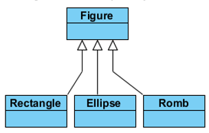

# Паттерны

## Порождающие

### Создание объектов. Нужны, что бы объекты точно удалялись (не оставались как балласт) и не удалялись раньше времени

1. [Singleton](https://github.com/Grezer/patterns#singleton)
2. [Factory method](https://github.com/Grezer/patterns#factory-method-virtual-constructor)
3. [Prototype](https://github.com/Grezer/patterns#prototype)
4. [Abstract factory](https://github.com/Grezer/patterns#abstract-factory-kit)
5. Builder

## Структурные

### Создание сложных объектов из простых, не используя наследование

1. Adapter
2. Decorator
3. Composite
4. Proxy
5. Facade
6. Bridge
7. Flyweight

## Поведенческие

### Изменение поведения объектов в run time (объект должен по разному себя вести в разные моменты времени)

1. Chain of Responsibility
2. Command
3. Iterator
4. Observer
5. State
6. Strategy
7. Mediator
8. Memento
9. Template method
10. Visitor

## Cистемные: допишу

## Принципы ООП (SOLID): допишу

## Словечки

Low coupling - низкая связность. Такая конструкция, которая слабо связана (неизменяемость интерфейсов и инкапсуляция классов).

---

## Singleton

Создание класса без публичных констркторов.  
Применяется когда нужен класс, который:

- гарантированно имел бы <b>ОДИН</b> экземпляр
- этот экземпляр должен быть доступен в любой точке приложения

### [Refactoring guru](https://refactoring.guru/ru/design-patterns/singleton)

### Назначение

> Гарантирует, что у класса есть только один экземпляр, и предоставляет к нему глобальную точку доступа

### Мотивация

> Для многих программных систем иногда нужно, чтобы существовал единственный экземпляр класса. Например оконный менеджер. Как гарантировать единственность и доступность этого экземпляра?

### Структура

<p align="center">
  
</p>

### Реализация

```C#
// Пример класса
public class Singleton
{
    private Singleton() {}
    private static Singleton_instance = null;
    public void DoSome() {}

    public static Singleton GetInstance()
    {
        if(_instance == null)
            _instance = new Singleton();
        return _instance
    }
}

// Пример использования
Singleton single = Singleton.GetInstance();
single.DoSome();
```

### Разультаты

- (+) Гарантируется единственность экземпляра класса и его глобальная доступность.
- (-) Может создавать проблемы в параллельных и/или распределенных приложениях. В этих случаях необходимо более сложное решение.

---

## Factory method (Virtual Constructor)

Синоним: Virtual Constructor

Применяется, когда есть множество разнородных объектов, например, много фигур: прямоугольник, треугольник, элипс и т.д.

### [Refactoring guru](https://refactoring.guru/ru/design-patterns/factory-method)

### Назначение

> Определяет интерфейс для создания объекта, оставляя подклассам решение о том, какой класс инстанцировать.

### Мотивация

> Рассмотрим пример с редактором векторной графики.  
> Все фигуры, доступные в данном приложении являются объектами подклассов базового класса Figure, в нашем примере – Rectangle, Ellipse и Romb.  
>   
> Здесь пользователь сначала выбирает тип порождаемой фигуры в инструментальном меню, а потом по клику в рабочей области создается экземпляр соответствующего класса.  
> Тогда код метода <i>panel_MouseDown</i> будет следующим:

```C#
Figure f = null;
switch (selection)
{
    case 1:
        f = new Rectangle();
        break;
    case 2:
        f = new Ellipse();
        break;
}
```

> Многие современные программы работают с плагинами – кодом, добавляемым во время исполнения программы.  
> Как добавить новую фигуру во время исполнения?

### Решение

Создание параллельно с иерархией классов Figure, иерархию классов FigureCreator.  


```C#
class FigureCreator
{
    public virtual Figure CreateFigure()
    {
        return null;
    }
}

// Creator прямоугольника
class RectangleCreator : FigureCreator
{
    public override Figure CreateFigure()
    {
        return new Rectangle();
    }
}

// Creator элипса
class EllipseCreator : FigureCreator
{
    public override Figure CreateFigure()
    {
        return new Ellipse();
    }
}
```

Теперь код метода panel_MouseDown будет более управляемый, где currCreator соответствующий экземпляр класса FigureCreator, инициируемый при нажатии на кнопку выбора создаваемой фигуры.  
Для добавления новой фигуры надо:

- написать класс, наследник Figure,
- написать класс, наследник FigureCreator,
- добавить новую кнопку на панель и код инициализации этого «создателя» на эту кнопку.

```C#
Figure f = null;
if (currCreator != null)
    f = currCreator.CreateFigure();
```

### Структура


### Участники

<b>Product</b> – базовый класс для семейства конкретных продуктов, экземпляры которых должны инстанцироваться.  
<b>Creator</b> – базовый класс для семейства «создателей», классы реализующие метод, создающий новый экземпляр соответствующего класса.  
Для каждого класса ConcreteProduct должен быть соответствующий класс ConcreteCreator, задача которого изготавливать экземпляры класса ConcreteProduct.

### Разультаты

- (+) Снижает зависимость между классами. В нашем примере редактор работает только с экземплярами класса Figure, экземпляры конкретных классов создаются с помощью «создателя».
- (+) Решает задачу "разрывающую" два разных события:
  1. Выбор "кого мы делаем" (прямоугольник/треугольник/элипс)
  2. Изготовление этого экземпляра

---

## Prototype

Применяется, когда нужно создавать объекты одного класса, различающиеся только свойствами (копировать).

### [Refactoring guru](https://refactoring.guru/ru/design-patterns/prototype)

### Назначение

> Создание нового объекта путем клонирования существующего прототипа.

### Мотивация

> В качестве примера рассмотрим нотный редактор.  
> В качестве рабочей области в нем будет нотный стан, а в качестве инструментальной линейки – набор нот разной высоты и длительности.  
> Основным объектом в такой программе будет нота – класс Note.  
> <b>Вопрос</b>: как создавать новые экземпляры этого класса? Что делать по клику в инструментальной панели?  
> <b>Решение</b>: добавить в класс Note метод Clone(), создающий точную копию объекта.  
> С каждой кнопкой связать экземпляр класса Note, копию которого и вставлять в программу.

> Второй пример – группировка различных фигур в векторном редакторе.  
> <b>Вопрос</b>: Если вы сгруппировали интересную для вас композицию (точка, точка, два кружочка …), то как ее поместить на инструментальную панель?  
> Точнее – что делать при нажатии на эту кнопку и как создать новый экземпляр этой группы?  
> <b>Решение</b>: как и в предыдущем случае добавим в базовом классе Figure метод Clone, создающий копию объекта.  
> Соответствующий кнопке «создатель» будет иметь копию группы как прототип создаваемого объекта, и в методе CreateFigure – создавать и возвращать копию своего прототипа.

### Структура


### Участники

<b>Client</b> – класс, использующий этот паттерн. В нашем случае, например, векторный редактор.  
Он содержит ссылку на прототип, который может быть инстанцирован объектом любого класса – наследника Prototype.  
<b>Prototype</b> – базовый абстрактный класс для семейства классов, поддерживающих операцию Clone(), метод позволяющий получить копию объекта.  
<b>ConcretePrototype1, ConcretePrototype2</b> – классы наследующие Prototype и реализующие метод Clone.

### Реализация

<b>Основная проблема</b> в реализации метода Clone – определить глубокое (deep) или мелкое (shallow) копирование объекта.

Общий подход к реализации метода простой:  
Надо создать новый экземпляр и скопировать туда значение полей объекта.  
Разница возникает, когда поле объекта содержит ссылку на другой объект какого-то класса.

- Если дубликат получает копию ссылки, то это мелкое копирование.
- Если ссылаемый объект, в свою очередь, дублируется и дубликат получает ссылку на копию объекта, то это глубокое копирование.

<b>Второй вопрос</b> – как управлять множеством прототипов.

Для этого логично завести менеджер прототипов – коллекцию прототипов, каждый объект в котором идентифицируется своим ключом.  
Client запрашивает нужный ему прототип по ключу перед клонированием.

### Разультаты

- (+) Ослабление связности.
- (+) Возможно добавление и удаление прототипов во время выполнения.
- (+) Спецификация новых прототипов путем изменения значений.
- (+) Динамическое конфигурирование приложения набором прототипов.

---

## Abstract factory (kit)

Применяется, когда нужно порождать много разных объектов, но из одного семейства, например: разные коллекции кухонной мебели (столы, шкафы, стулья).

### [Refactoring guru](https://refactoring.guru/ru/design-patterns/abstract-factory)

### Назначение

> Определяет интерфейс для создания семейств взаимосвязанных или взаимозависимых объектов, не специфицируя их конкретных классов.

### Мотивация

> В качестве классического примера рассмотрим переносимую библиотеку GUI.  
> Пусть некоторое приложение с поддержкой графического интерфейса пользователя рассчитано на использование на различных платформах, при этом внешний вид этого интерфейса должен соответствовать принятому стилю для той или иной платформы.  
> Например, если это приложение установлено на Windows-платформу, то его кнопки, меню, полосы прокрутки должны отображаться в стиле, принятом для Windows.  
> Группой взаимосвязанных объектов в этом случае будут элементы графического интерфейса пользователя для конкретной платформы.

> Другой пример.  
> Рассмотрим текстовый редактор с многоязычной поддержкой, у которого имеются функциональные модули, отвечающие за расстановку переносов слов и проверку орфографии.  
> Если, скажем, открыт документ на русском языке, то должны быть подключены соответствующие модули, учитывающие специфику русского языка.  
> Ситуация, когда для такого документа одновременно используются модуль расстановки переносов для русского языка и модуль проверки орфографии для немецкого языка, исключается.  
> Здесь группой взаимосвязанных объектов будут соответствующие модули, учитывающие специфику некоторого языка.

### Реализация

Для решения задачи по созданию семейств взаимосвязанных объектов паттерн Abstract Factory вводит понятие абстрактной фабрики.  
Абстрактная фабрика представляет собой некоторый полиморфный базовый класс, назначением которого является объявление интерфейсов фабричных методов, служащих для создания продуктов всех основных типов (один фабричный метод на каждый тип продукта).  
Производные от него классы, реализующие эти интерфейсы, предназначены для создания продуктов всех типов внутри семейства или группы.

### Структура


### Разультаты

- (+) Скрывает сам процесс порождения объектов, а также делает систему независимой от типов создаваемых объектов, специфичных для различных семейств или групп (пользователи оперируют этими объектами через соответствующие абстрактные интерфейсы).
- (+) Позволяет быстро настраивать систему на нужное семейство создаваемых объектов.  
  В случае многоплатформенного графического приложения для перехода на новую платформу, то есть для замены графических элементов (кнопок, меню, полос прокрутки) одного стиля другим достаточно создать нужный подкласс абстрактной фабрики.  
  При этом условие невозможности одновременного использования элементов разных стилей для некоторой платформы будет выполнено автоматически.
- (-) Трудно добавлять новые типы создаваемых продуктов или заменять существующие, так как интерфейс базового класса абстрактной фабрики фиксирован.
