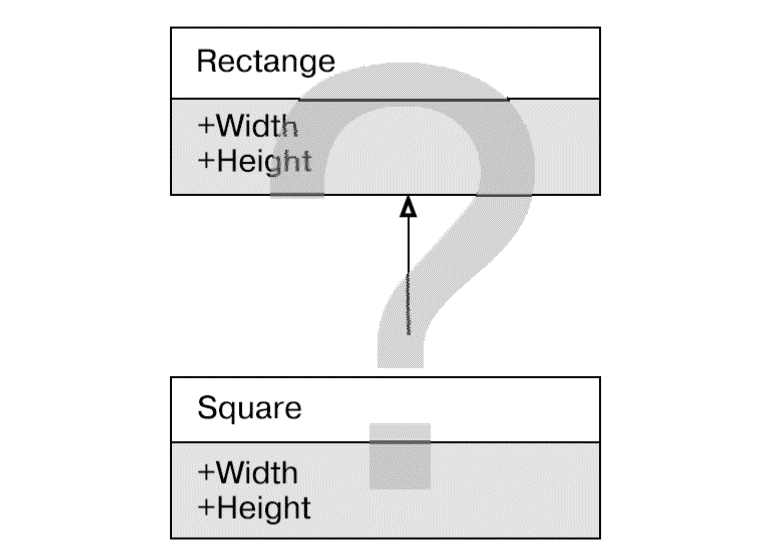

# Паттерны

## Порождающие

### Создание объектов. Нужны, что бы объекты точно удалялись (не оставались как балласт) и не удалялись раньше времени

1. [Singleton](https://github.com/Grezer/patterns#singleton)
2. [Factory method](https://github.com/Grezer/patterns#factory-method-virtual-constructor)
3. [Prototype](https://github.com/Grezer/patterns#prototype)
4. [Abstract factory](https://github.com/Grezer/patterns#abstract-factory-kit)
5. [Builder](https://github.com/Grezer/patterns#builder)

## Структурные

### Создание сложных объектов из простых. При этом могут использоваться следующие механизмы:

- Наследование, когда базовый класс определяет интерфейс, а подклассы - реализацию. Структуры, на основе наследования, получаются статическими.
- Композиция, когда структуры строятся путем объединения объектов некоторых классов. Композиция позволяет получать структуры, которые можно изменять во время выполнения.

1. [Adapter](https://github.com/Grezer/patterns#adapter-wrapper)
2. [Composite](https://github.com/Grezer/patterns#composite)
3. [Decorator](https://github.com/Grezer/patterns#decorator-wrapper)
4. [Proxy](https://github.com/Grezer/patterns#proxy-surrogate)
5. [Facade](https://github.com/Grezer/patterns#facade)
6. [Bridge](https://github.com/Grezer/patterns#bridge-handlebody)
7. [Flyweight](https://github.com/Grezer/patterns#flyweight)

## Поведенческие

### Изменение поведения объектов в run time (объект должен по разному себя вести в разные моменты времени)

1. [Chain of Responsibility](https://github.com/Grezer/patterns#chain-of-responsibility)
2. [Command](https://github.com/Grezer/patterns#command-action--transaction)
3. [Iterator](https://github.com/Grezer/patterns#iterator-cursor)
4. [Observer](https://github.com/Grezer/patterns#observer-dependents-publish--subsribe)
5. [State](https://github.com/Grezer/patterns#state)
6. [Strategy](https://github.com/Grezer/patterns#strategy-policy)
7. [Mediator](https://github.com/Grezer/patterns#mediator)
8. [Memento](https://github.com/Grezer/patterns#memento-token)
9. [Template method](https://github.com/Grezer/patterns#template-method-nvm--not-virtual-method)
10. [Visitor](https://github.com/Grezer/patterns#visitor)

## Cистемные

### Системные паттерны находятся на следующем уровне конструирования ПО по сравнению с паттернами банды четырёх (GoF). Они, как правило, обеспечивают взаимодействие компонент (сборок) программной системы

1. [MVC](https://github.com/Grezer/patterns#mvc)
2. [MVP](https://github.com/Grezer/patterns#mvp)
3. [Session](https://github.com/Grezer/patterns#session)
4. [Worker Thread](https://github.com/Grezer/patterns#worker-thread)
5. [Thread Pool](https://github.com/Grezer/patterns#thread-pool)
6. [Callback](https://github.com/Grezer/patterns#callback-hollywood)
7. [Transaction](https://github.com/Grezer/patterns#transaction)

## Принципы ООП (SOLID)

1. [SRP](https://github.com/Grezer/patterns#srp)
2. [OCP](https://github.com/Grezer/patterns#ocp)
3. [LSP](https://github.com/Grezer/patterns#lsp)
4. [ISP](https://github.com/Grezer/patterns#icp)
5. [DIP](https://github.com/Grezer/patterns#dip)

---

## GRASP

<i>General Responsibility Assignment Software Patterns - Общие паттерны распределения обязанностей
</i>

### GRASP - паттерны, используемые в объектно-ориентированном проектировании для решения общих задач по назначению обязанностей классам и объектам.

Эта группа паттернов предназначенная <b>для самых ранних этапов</b> развития программных систем.

Разработка любой программной системы включает:

1. Анализ предметной области. Результат: <b>Модель предметной области</b> или <i>Domain model</i>

2. Беседа со стейкхолдерами. Результат: <b>Набор требований</b>

Теперь надо выстроить программную модель, которая соответствовала бы и <b>Модели предметной области</b>, и <b>Набору требований</b>.

На этом этапе проектирования системы (хотя бы на уровне "квадратиков") огромную роль играют паттерны GRASP.

GRASP (<i>в отличие от паттернов GOF, которые описывают типичные конструкции на уровне классов</i>) применяются когда мы пытаемся выстроить программную модель. Другими словами, когда мы должны тщательно расписать обязанности каждого класса в нашей системе.  
Это очень важный и очень высокий уровень абстракций, поэтому тут нет простых схем и рецптов.  
<b>GRASP - это набор принципов, а не паттернов или шаблонов.</b>

1. [Information Expert (Информационный эксперт)](https://github.com/Grezer/patterns#information-expert-%D0%B8%D0%BD%D1%84%D0%BE%D1%80%D0%BC%D0%B0%D1%86%D0%B8%D0%BE%D0%BD%D0%BD%D1%8B%D0%B9-%D1%8D%D0%BA%D1%81%D0%BF%D0%B5%D1%80%D1%82)
1. Creator (Создатель)
1. ~~Controller (Контроллер)~~
1. Low Coupling (Слабая связанность)
1. High Cohesion (Сильное Сцепление)
1. Polymorphism (Полиморфизм)
1. Pure Fabrication (Чистая выдумка)
1. Indirection (Посредник)
1. Protected Variations (Сокрытие реализации)

---

## Singleton

[↑ В начало](https://github.com/Grezer/patterns#паттерны)

Создание класса без публичных констркторов.  
Применяется когда нужен класс, который:

- гарантированно имел бы <b>ОДИН</b> экземпляр
- этот экземпляр должен быть доступен в любой точке приложения

### [Refactoring guru](https://refactoring.guru/ru/design-patterns/singleton)

### Назначение

> Гарантирует, что у класса есть только один экземпляр, и предоставляет к нему глобальную точку доступа

### Мотивация

> Для многих программных систем иногда нужно, чтобы существовал единственный экземпляр класса. Например оконный менеджер. Как гарантировать единственность и доступность этого экземпляра?

### Структура

<p align="center">
  
</p>

### Реализация

```C#
// Пример класса
public class Singleton
{
    private Singleton() {}
    private static Singleton_instance = null;
    public void DoSome() {}

    public static Singleton GetInstance()
    {
        if(_instance == null)
            _instance = new Singleton();
        return _instance
    }
}

// Пример использования
Singleton single = Singleton.GetInstance();
single.DoSome();
```

### Разультаты

- (+) Гарантируется единственность экземпляра класса и его глобальная доступность.

- (-) Может создавать проблемы в параллельных и/или распределенных приложениях. В этих случаях необходимо более сложное решение.

---

## Factory method (Virtual Constructor)

[↑ В начало](https://github.com/Grezer/patterns#паттерны)

Синоним: Virtual Constructor

Применяется, когда есть множество разнородных объектов, например, много фигур: прямоугольник, треугольник, элипс и т.д.

### [Refactoring guru](https://refactoring.guru/ru/design-patterns/factory-method)

### Назначение

> Определяет интерфейс для создания объекта, оставляя подклассам решение о том, какой класс инстанцировать.

### Мотивация

> Рассмотрим пример с редактором векторной графики.  
> Все фигуры, доступные в данном приложении являются объектами подклассов базового класса Figure, в нашем примере – Rectangle, Ellipse и Romb.  
>   
> Здесь пользователь сначала выбирает тип порождаемой фигуры в инструментальном меню, а потом по клику в рабочей области создается экземпляр соответствующего класса.  
> Тогда код метода <i>panel_MouseDown</i> будет следующим:

```C#
Figure f = null;
switch (selection)
{
    case 1:
        f = new Rectangle();
        break;
    case 2:
        f = new Ellipse();
        break;
}
```

> Многие современные программы работают с плагинами – кодом, добавляемым во время исполнения программы.  
> Как добавить новую фигуру во время исполнения?

### Решение

Создание параллельно с иерархией классов Figure, иерархию классов FigureCreator.  


```C#
class FigureCreator
{
    public virtual Figure CreateFigure()
    {
        return null;
    }
}

// Creator прямоугольника
class RectangleCreator : FigureCreator
{
    public override Figure CreateFigure()
    {
        return new Rectangle();
    }
}

// Creator элипса
class EllipseCreator : FigureCreator
{
    public override Figure CreateFigure()
    {
        return new Ellipse();
    }
}
```

Теперь код метода panel_MouseDown будет более управляемый, где currCreator соответствующий экземпляр класса FigureCreator, инициируемый при нажатии на кнопку выбора создаваемой фигуры.  
Для добавления новой фигуры надо:

- написать класс, наследник Figure,
- написать класс, наследник FigureCreator,
- добавить новую кнопку на панель и код инициализации этого «создателя» на эту кнопку.

```C#
Figure f = null;
if (currCreator != null)
    f = currCreator.CreateFigure();
```

### Структура


### Участники

<b>Product</b> – базовый класс для семейства конкретных продуктов, экземпляры которых должны инстанцироваться.  
<b>Creator</b> – базовый класс для семейства «создателей», классы реализующие метод, создающий новый экземпляр соответствующего класса.  
Для каждого класса ConcreteProduct должен быть соответствующий класс ConcreteCreator, задача которого изготавливать экземпляры класса ConcreteProduct.

### Разультаты

- (+) Снижает зависимость между классами. В нашем примере редактор работает только с экземплярами класса Figure, экземпляры конкретных классов создаются с помощью «создателя».

- (+) Решает задачу "разрывающую" два разных события:
  1. Выбор "кого мы делаем" (прямоугольник/треугольник/элипс)
  2. Изготовление этого экземпляра

---

## Prototype

[↑ В начало](https://github.com/Grezer/patterns#паттерны)

Применяется, когда нужно создавать объекты одного класса, различающиеся только свойствами (копировать).

### [Refactoring guru](https://refactoring.guru/ru/design-patterns/prototype)

### Назначение

> Создание нового объекта путем клонирования существующего прототипа.

### Мотивация

> В качестве примера рассмотрим нотный редактор.  
> В качестве рабочей области в нем будет нотный стан, а в качестве инструментальной линейки – набор нот разной высоты и длительности.  
> Основным объектом в такой программе будет нота – класс Note.  
> <b>Вопрос</b>: как создавать новые экземпляры этого класса? Что делать по клику в инструментальной панели?  
> <b>Решение</b>: добавить в класс Note метод Clone(), создающий точную копию объекта.  
> С каждой кнопкой связать экземпляр класса Note, копию которого и вставлять в программу.

> Второй пример – группировка различных фигур в векторном редакторе.  
> <b>Вопрос</b>: Если вы сгруппировали интересную для вас композицию (точка, точка, два кружочка …), то как ее поместить на инструментальную панель?  
> Точнее – что делать при нажатии на эту кнопку и как создать новый экземпляр этой группы?  
> <b>Решение</b>: как и в предыдущем случае добавим в базовом классе Figure метод Clone, создающий копию объекта.  
> Соответствующий кнопке «создатель» будет иметь копию группы как прототип создаваемого объекта, и в методе CreateFigure – создавать и возвращать копию своего прототипа.

### Структура


### Участники

<b>Client</b> – класс, использующий этот паттерн. В нашем случае, например, векторный редактор.  
Он содержит ссылку на прототип, который может быть инстанцирован объектом любого класса – наследника Prototype.  
<b>Prototype</b> – базовый абстрактный класс для семейства классов, поддерживающих операцию Clone(), метод позволяющий получить копию объекта.  
<b>ConcretePrototype1, ConcretePrototype2</b> – классы наследующие Prototype и реализующие метод Clone.

### Реализация

<b>Основная проблема</b> в реализации метода Clone – определить глубокое (deep) или мелкое (shallow) копирование объекта.

Общий подход к реализации метода простой:  
Надо создать новый экземпляр и скопировать туда значение полей объекта.  
Разница возникает, когда поле объекта содержит ссылку на другой объект какого-то класса.

- Если дубликат получает копию ссылки, то это мелкое копирование.
- Если ссылаемый объект, в свою очередь, дублируется и дубликат получает ссылку на копию объекта, то это глубокое копирование.

<b>Второй вопрос</b> – как управлять множеством прототипов.

Для этого логично завести менеджер прототипов – коллекцию прототипов, каждый объект в котором идентифицируется своим ключом.  
Client запрашивает нужный ему прототип по ключу перед клонированием.

### Разультаты

- (+) Ослабление связности.

- (+) Возможно добавление и удаление прототипов во время выполнения.

- (+) Спецификация новых прототипов путем изменения значений.

- (+) Динамическое конфигурирование приложения набором прототипов.

---

## Abstract factory (kit)

[↑ В начало](https://github.com/Grezer/patterns#паттерны)

Применяется, когда нужно порождать много разных объектов, но из одного семейства, например: разные коллекции кухонной мебели (столы, шкафы, стулья).

### [Refactoring guru](https://refactoring.guru/ru/design-patterns/abstract-factory)

### Назначение

> Определяет интерфейс для создания семейств взаимосвязанных или взаимозависимых объектов, не специфицируя их конкретных классов.

### Мотивация

> В качестве классического примера рассмотрим переносимую библиотеку GUI.  
> Пусть некоторое приложение с поддержкой графического интерфейса пользователя рассчитано на использование на различных платформах, при этом внешний вид этого интерфейса должен соответствовать принятому стилю для той или иной платформы.  
> Например, если это приложение установлено на Windows-платформу, то его кнопки, меню, полосы прокрутки должны отображаться в стиле, принятом для Windows.  
> Группой взаимосвязанных объектов в этом случае будут элементы графического интерфейса пользователя для конкретной платформы.

> Другой пример.  
> Рассмотрим текстовый редактор с многоязычной поддержкой, у которого имеются функциональные модули, отвечающие за расстановку переносов слов и проверку орфографии.  
> Если, скажем, открыт документ на русском языке, то должны быть подключены соответствующие модули, учитывающие специфику русского языка.  
> Ситуация, когда для такого документа одновременно используются модуль расстановки переносов для русского языка и модуль проверки орфографии для немецкого языка, исключается.  
> Здесь группой взаимосвязанных объектов будут соответствующие модули, учитывающие специфику некоторого языка.

### Реализация

Для решения задачи по созданию семейств взаимосвязанных объектов паттерн Abstract Factory вводит понятие абстрактной фабрики.  
Абстрактная фабрика представляет собой некоторый полиморфный базовый класс, назначением которого является объявление интерфейсов фабричных методов, служащих для создания продуктов всех основных типов (один фабричный метод на каждый тип продукта).  
Производные от него классы, реализующие эти интерфейсы, предназначены для создания продуктов всех типов внутри семейства или группы.

### Структура


### Разультаты

- (+) Скрывает сам процесс порождения объектов, а также делает систему независимой от типов создаваемых объектов, специфичных для различных семейств или групп (пользователи оперируют этими объектами через соответствующие абстрактные интерфейсы).

- (+) Позволяет быстро настраивать систему на нужное семейство создаваемых объектов.  
  В случае многоплатформенного графического приложения для перехода на новую платформу, то есть для замены графических элементов (кнопок, меню, полос прокрутки) одного стиля другим достаточно создать нужный подкласс абстрактной фабрики.  
  При этом условие невозможности одновременного использования элементов разных стилей для некоторой платформы будет выполнено автоматически.

- (-) Трудно добавлять новые типы создаваемых продуктов или заменять существующие, так как интерфейс базового класса абстрактной фабрики фиксирован.

---

## Builder

[↑ В начало](https://github.com/Grezer/patterns#паттерны)

Применяется, когда нужно порождать объекты, требующие пошаговой инициализации множества полей и вложенных объектов.

### [Refactoring guru](https://refactoring.guru/ru/design-patterns/builder)

### Назначение

> Отделяет создание сложного объекта от его представления, так что в результате одного и того же процесса создания могут получаться разные представления.

### Мотивация

> Предположим, что вы разрабатываете супер текстовый редактор, позволяющий делать сверхсложные и очень красивые документы.  
> Нужно предусмотрить вывод готового документа в любой из стандартных форматов – PDF, в виде HTML и в виде Microsoft Word документа.  
> Таким образом в главном меню вашего редактора должен быть пункт Save As, где в качестве подпунктов – as PFD document, as HTML, as Microsoft Word.  
> <b>Вопрос</b>: как будет выглядеть реализация этих пунктов меню?  
> Первое, что приходит в голову – фабричные методы типа следующих:

```C#
private PDFDocument MakePDFDocument(MySuperDocument myDoc)          { ... }
private HTMLDocument MakeHTMLDocument(MySuperDocument myDoc)        { ... }
private MSWordDocument MakeMSWordDocument(MySuperDocument myDoc)    { ... }
```

> При таком подходе сильная связность между сложными сущностями. Хотелось бы ослабить эту связь.
> Вместо того, чтобы создавать новый тип за один шаг, предлагается делать его по шагам. Аналогично тому, как строится дом.  
> Сначала фундамент, потом первый этаж, потом второй и т.д. После этого крыша. После – отделка, внутренние коммуникации и т.п.  
> Документ тоже имеет структуру и состоит из составных частей разного уровня: абзацы, картинки, таблицы, параграфы и главы и т.д.

### Реализация

Builder определяет алгоритм поэтапного создания продукта в специальном классе Director (распорядитель), а ответственность за координацию процесса сборки отдельных частей продукта возлагает на иерархию классов Builder.  
В этой иерархии базовый класс Builder объявляет интерфейсы для построения отдельных частей продукта, а соответствующие подклассы ConcreteBuilder их реализуют подходящим образом, например, создают или получают нужные ресурсы, сохраняют промежуточные результаты, контролируют результаты выполнения операций.

### Структура


Класс Director содержит указатель или ссылку на Builder, который перед началом работы должен быть сконфигурирован экземпляром ConcreteBuilder, определяющим соответствующе представление.  
После этого Director может обрабатывать клиентские запросы на создание объекта.  
Получив такой запрос, с помощью имеющегося экземпляра строителя Director строит продукт по частям, а затем возвращает его пользователю.


### Разультаты

- (+) Возможность контролировать процесс создания сложного продукта.

- (+) Возможность получения разных представлений некоторых данных.

- (-) ConcreteBuilder и создаваемый им продукт жестко связаны между собой, поэтому при внесении изменений в класс продукта скорее всего придется соответствующим образом изменить и класс ConcreteBuilder.

---

## Adapter (Wrapper)

[↑ В начало](https://github.com/Grezer/patterns#паттерны)

### [Refactoring guru](https://refactoring.guru/ru/design-patterns/adapter)

### Назначение

> Паттерн, позволяющий преобразовать интерфейс существующего класса в интерфейс требуемого класса.

### Мотивация

> Для примера рассмотрим программу – векторный редактор.  
> Все графические объекты в этой программе – наследники класса Figure.  
> <b>Вопрос</b>: можно ли использовать в этой программе объекты класса, не являющегося наследником Figure, но являющегося графическими объектами.  
> <b>Решение</b>: создать класс – наследник Figure: LinkToFlower, cсодержащий ссылку на экземпляр класса Flower.  
> Задача класса LinkToFlower – реализовать все методы класса Figure, используя методы класса Flower.  
> Шаблон Adapter – обобщение этого решения.


### Структура

- <b>Client</b> – класс, использующий экземпляр класса Target (приложение)
- <b>Target</b> – базовый (абстрактный) класс для группы классов
- <b>ConcreteTarget</b> – конкретный класс, наследник Target
- <b>Adapter</b> – наследник Target, содержащий ссылку на экземпляр Adaptee
- <b>Adaptee</b> – адаптируемый класс


### Реализация

Сложность реализации зависит от степени удаленности адаптируемого класса Adaptee от требуемого класса Target.  
<b>Важный случай</b> – адаптер к семейству классов. Если, например, адаптируемый класс Flower является наследником класса GenericFigure, являющегося базовым классом для семейства ряда графических объектов, можно реализовать адаптер для всего семейства, сделав его для базового класса.  
Возникает сложность – создание конкретного адаптируемого объекта.

### Разультаты

- (+) Повышает гибкость, позволяя использовать классы, не входящие в требуемую иерархию.

- (+) Ослабляет связь между клиентом и фактически используемым классом.

---

## Composite

[↑ В начало](https://github.com/Grezer/patterns#паттерны)

### [Refactoring guru](https://refactoring.guru/ru/design-patterns/composite)

### Назначение

> Компонует объекты в древовидные структуры для представления иерархий <i>часть-целое</i>. Позволяет единообразно рассматривать как индивидуальные, так и составные объекты.

### Мотивация

> Для примера рассмотрим программу – векторный редактор.  
> Все графические объекты в этой программе – наследники класса Figure.  
> Любой приличный редактор позволяет группировать объекты в группы, что дает возможность манипулировать такой группой как обычной фигурой.
> Понятно, что нужен новый класс – наследник Figure, который будет содержать список фигур, входящих в группу.  
> Возникает несколько вопросов:
>
> - Как отличить простую фигуру от составной?
> - Как определить значения полей базового класса: координаты левого верхнего угла, ширина, высота для группы фигур?


### Структура

- <b>Component</b> – базовый класс для семейства компонентов
- <b>IСomposite</b> – интерфейс для составных объектов
- <b>Composite</b> – составной компонент, содержащий список компонентов


### Реализация

Для нашего примера интерфейс IGroup мог бы выглядеть так:

```C#
interface IGroup
{
    void Add(Figure f);
    void Remove(Figure f);
    Figure GetItem(int indx);
}
```

Для проверки, является ли конкретный объект сложным или простым, надо проверить:

```C#
if (fig is IGroup)
```

Для более общего случая лучше сделать обобщенный интерфейс:

```C#
interface IGroup <T>
{
    void Add(T f);
    void Remove(T f);
    T GetItem(int indx);
}
```

### Разультаты

- (+) Позволяет построить единую иерархию классов, состоящих как из элементарных, так и составных объектов.

- (+) Упрощает архитектуру клиента. Позволяет клиентской программе работать единообразно со всеми объектами, кроме тех случаев, когда нужно различать составные и элементарные объекты (например операция Ungroup).

- (+) Облегчается добавление новых компонентов.

---

## Decorator (Wrapper)

[↑ В начало](https://github.com/Grezer/patterns#паттерны)

### [Refactoring guru](https://refactoring.guru/ru/design-patterns/decorator)

### Назначение

> Динамически добавляет объекту новые обязанности.  
> Является гибкой альтернативой порождению подклассов с целью расширения обязанностей.  
> Используется в первую очередь для добавления функционала.

### Мотивация

> Иногда нужно добавить новые дополнительные обязанности конкретному объекту, а не классу в целом.  
> Конечно, есть стандартный способ – создать подкласс, добавив в него дополнительную функциональность.  
> Стандартный пример – текстовый компонент в графическом редакторе.  
> Стандартный компонент позволяет поместить текст внутри компонента.  
> Сам компонент может перемещаться внутри картинки, можно менять шрифт, его цвет и т.п.  
> Дополнительная функциональность:
>
> - хочется иметь возможность включить рамку вокруг текста, с возможностью менять ее толщину, цвет, стиль и т.п.
> - хочется иметь прокрутку (Scroll), что позволяет поместить большой текст внутри небольшого компонента и прокручивать его содержимое.
>
> В стандартном подходе понадобятся три наследника класса TextView: BorderTextVew, ScrollTextView, BorderScrollTextView для текста с рамкой, с прокруткой и с рамкой вместе с прокруткой. А если надо добавить еще одно украшение?

### Идея

> Идея декоратора проста – мы просто создаем класс, наследник базового с требуемой дополнительной функциональностью.  
> Но основную функциональность перекладываем на экземпляр класса, интегрированный в объект.  
> Например для рамки заведем класс BorderDecoratorTextView.

```C#
class BorderDecoratorTextView : TextView
{
    TextView view;

    public override void Draw()
    {
        // draw Border
        view.Draw();
    }
}
```

### Структура

- <b>Component</b> – базовый класс для семейства компонентов
- <b>ConcreteComponent</b> – конкретный класс компонента
- <b>Decorator</b> – базовый класс для декораторов
- <b>ConcDecorator1</b> – декоратор с добавленной функциональностью (методом)
- <b>ConcDecorator2</b> – декоратор с добавленным состоянием.


### Реализация

- Класс Decorator использует отношение композиции.
- Указатель на декорируемый объект инициализируется в конструкторе.
- Класс Decorator делегирует выполнение операции декорируемому объекту.
- Для реализации каждой дополнительной функциональности создайте класс, производный от Decorator.
- Подкласс Decorator реализует дополнительную функциональность и делегирует выполнение операции базовому классу Decorator.
- Клиент несет ответственность за конфигурирование системы: устанавливает типы и последовательность использования основного объекта и декораторов.

### Разультаты

- (+) Большая гибкость, чем у статического наследования.

- (+) Позволяет избежать перегруженных методами классов на верхних уровнях иерархии.

- (-) Декоратор и его компонент, вообще говоря, не идентичны.

- (-) Порождает большое число мелких объектов.

---

## Proxy (surrogate)

[↑ В начало](https://github.com/Grezer/patterns#паттерны)

### [Refactoring guru](https://refactoring.guru/ru/design-patterns/proxy)

### Назначение

> Является суррогатом другого объекта и контролирует доступ к нему.

> <b>Заместитель</b> — это структурный паттерн проектирования, который позволяет подставлять вместо реальных объектов специальные объекты-заменители.  
> Эти объекты перехватывают вызовы к оригинальному объекту, позволяя сделать что-то до или после передачи вызова оригиналу.

### Когда следует использовать?

1. Виртуальный proxy является заместителем объектов, создание которых обходится дорого. Реальный объект создается только при первом запросе/доступе клиента к объекту.
2. Удаленный proxy предоставляет локального представителя для объекта, который находится в другом адресном пространстве ("заглушки" в RPC и CORBA).
3. Защитный proxy контролирует доступ к основному объекту. "Суррогатный" объект предоставляет доступ к реальному объекту, только если вызывающий объект имеет соответствующие права.
4. Интеллектуальный proxy выполняет дополнительные действия при доступе к объекту.

### Мотивация

> Вам нужно управлять ресурсоемкими объектами.  
> Вы не хотите создавать экземпляры таких объектов до момента их реального использования.  
> Суррогат или заместитель это объект, интерфейс которого идентичен интерфейсу реального объекта.  
> При первом запросе клиента заместитель создает реальный объект, сохраняет его адрес и затем отправляет запрос этому реальному объекту.  
> Все последующие запросы просто переадресуются инкапсулированному реальному объекту

### Структура

- <b>Subject</b> – базовый класс
- <b>RealSubject</b> – реальный класс субъекта
- <b>Proxy</b> – заместитель, хранит ссылку на реальный субъект. Реальные обязанности зависят от назначения заместителя


### Реализация

- Определяется назначением заместителя.
- Для отложенной инициализации (виртуальный заместитель) – откладывает создание субъекта до прямого обращения к нему.
- Защищающий заместитель (Secure Stub) проверяет, имеет ли вызывающий необходимые для запроса права.
- Удаленный заместитель (Stub) отвечает за упаковку и передачу запроса реальному субъекту в другом адресном пространстве, а также за получение, распаковку и возращение результата.

### Разультаты

- (+) Удаленный заместитель скрывает тот факт, что субъект находится в другом адресном пространстве (или на другом континенте).

- (+) Виртуальный заместитель может выполнит оптимизацию, например отложить создание субъекта до первого требования.

- (+) Защищающий заместитель и «умная» ссылка позволяют решить дополнительные задачи при доступе к объекту (например copy_on_write механизм).

---

## Facade

[↑ В начало](https://github.com/Grezer/patterns#паттерны)

### [Refactoring guru](https://refactoring.guru/ru/design-patterns/facade)

### Назначение

> Предоставляет унифицированный интерфейс некоторой подсистемы.

### Мотивация

> При разбиении сложной системы на подсистемы возникает задача – свести к минимуму зависимость одной подсистемы от другой.  
> Фасад – один из способов решения этой задачи, предоставляет единый интерфейс для доступа к функциям подсистемы.  
> Например API Unix – является фасадом операционной системы для программиста.  
> Набор функций OpenGL – фасад большой библиотеки трехмерной графики.

### Структура

- <b>Facade</b> – фасад подсистемы
- <b>Elem1, Elem2, …</b> – элементы подсистемы


### Реализация

- Ключевой вопрос реализации – определение интерфейса фасада.
- Это определяет удобство и гибкость работы с подсистемой.
- Сравните для примера API Unix и Windows

### Разультаты

- (+) Изолирует клиента от деталей реализации подсистемы, что ослабляет связность.

- (+) Фасад не препятствует получение клиентом прямой ссылки на внутренний объект подсистемы (через метод фасада) для увеличения эффективности взаимодействия.

---

## Bridge (Handle/Body)

[↑ В начало](https://github.com/Grezer/patterns#паттерны)

### [Refactoring guru](https://refactoring.guru/ru/design-patterns/bridge)

### Назначение

> Отделяет абстракцию от реализации, так чтобы и то и другое можно было изменять независимо.

### Мотивация

> Рассмотрим иерархию графических примитивов, которые надо реализовать на различных графических средах (GDI, .Net, DirectX).  
> Идея состоит в том, что примитивы содержат геометрические свойства, а для рисования используют специальный класс – рисовальщик.  
> Например, для иерархии графических примитивов реализацией может обеспечивать вывод точки на дисплей.  
> Абстракцией – класс точки, а её уточнениями – классы линии, прямоугольника, круга и т.д.  
> Все они используют исходную реализацию для рисования и для того, чтобы перенести их на новую платформу достаточно заменить реализацию.

### Используется если нужно:

1. Независимо изменять интерфейс работы с клиентом и реализацию;
2. Выбирать реализацию в процессе работы программы;
3. Использовать одну реализацию в нескольких абстракциях;
4. Уменьшить число классов, получающихся при использовании наследования;

### Структура

- <b>Абстракция (Abstraction)</b> – определяет базовый интерфейс для работы с клиентом.
- <b>Уточненная абстракция (Refined abstraction)</b> – наследует абстракцию и вносит дополнительные свойства и методы.
- <b>Реализация (Implementor)</b> – определяет интерфейс реализаций.
- <b>Конкретная реализация (Concrete implementor)</b> – обеспечивает определенную функциональность.


### Реализация

> Очень важным моментом в проектировании Моста является разработка двух интерфейсов: абстракции и её взаимодействия с реализацией.  
> Чем меньше будет в них привязка к конкретной реализации, тем проще будет заменить её в дальнейшем.  
> Например, использование для задания координаты класса Point из .NET усложнит последующий перенос на WinAPI.  
> При порождении экземпляра объекта, выбор конкретной реализации можно переложить на порождающие шаблоны [Фабричный метод](https://github.com/Grezer/patterns#factory-method-virtual-constructor) или [Абстрактная фабрика](https://github.com/Grezer/patterns#abstract-factory-kit).  
> Кроме того, они же могут применяться для определения нужной клиенту уточненной абстракции.

### Разультаты

- (+) Проще расширять систему новыми типами за счет сокращения общего числа родственных подклассов.

- (+) Возможность динамического изменения реализации в процессе выполнения программы.

- (+) Паттерн Bridge полностью скрывает реализацию от клиента. В случае модификации реализации пользовательский код не требует изменений.

- (+) Обе стороны – и абстракция и реализация – могут изменяться независимо.

---

## Flyweight

[↑ В начало](https://github.com/Grezer/patterns#паттерны)

### [Refactoring guru](https://refactoring.guru/ru/design-patterns/flyweight)

### Назначение

> Паттерн Flyweight использует разделение для эффективной поддержки большого числа мелких объектов.

### Мотивация

> Проектирование системы из объектов самого низкого уровня обеспечивает оптимальную гибкость, но может быть неприемлемо "дорогим" решением с точки зрения производительности и расхода памяти.  
> Паттерн Flyweight описывает, как совместно разделять очень мелкие объекты без чрезмерно высоких издержек.  
> Каждый объект-приспособленец имеет две части: внутреннее и внешнее состояния.  
> Внутреннее состояние хранится (разделяется) в приспособленце и состоит из информации, не зависящей от его контекста.  
> Внешнее состояние хранится или вычисляется объектами-клиентами и передается приспособленцу при вызове его методов.

### Используется если нужно:

- Нужна поддержка огромного кол-ва однотипных объектов (например частицы в играх)

### Структура

Классы, описывающие различных насекомых Ant (муравей), Locust (саранча) и Cockroach (таракан) могут быть "легковесными", потому что специфичная для экземпляров информация может быть вынесена наружу и затем, передаваться клиентом в запросе.  
Класс Factory необходим для создания новых экземпляров или получения ссылки на уже существующий экземпляр


### Реализация

- Разделите состояние целевого класса на разделяемое (внутреннее) и неразделяемое (внешнее).
- Удалите из атрибутов (членов данных) класса неразделяемое состояние и добавьте его в список аргументов, передаваемых методам.
- Создайте фабрику, которая может кэшировать и повторно использовать существующие экземпляры класса.
- Для создания новых объектов клиент использует эту фабрику вместо оператора new.
- Клиент (или третья сторона) должен находить или вычислять неразделяемое состояние и передавать его методам класса.

<b>Основная проблема</b> – разделение класса.

### Разультаты

- (+) Эффективная работа с большим числом мелких объектов.

- (-) Необходимость ведения базы данных Flyweight в FlyweightFactory, т.е. отслеживание уже не используемых Flyweight.

---

## Chain of Responsibility

[↑ В начало](https://github.com/Grezer/patterns#паттерны)

### [Refactoring guru](https://refactoring.guru/ru/design-patterns/chain-of-responsibility)

### Назначение

> Позволяет избежать привязки отправителя запроса к конкретному получателю, давая возможность обработать запрос нескольким объектам.  
> Связывает объекты – получатели в цепочку и передает запрос вдоль этой цепочки, пока его не обработают.

### Мотивация

> Рассмотрим типичное Windows приложение.  
> В любой момент пользователь может нажать клавишу F1, ожидая получить подсказку.  
> Подсказка (Help), может быть как обычной – первая страница – оглавление, так и контекстно зависимой – т.е. высвечивается страница, соответствующее активному в данный момент окну приложения.  
> Обычно это достигается вызовом службы Help с идентификатором текущей страницы:  
> `Help.Show(helpCtx);` где <i>helpCtx</i> – индекс текущего окна.  
> Ситуация усложняется если программа допускает расширения в виде плагинов (plugin).  
> Новая функциональность, добавляемая с помощью плагина, может содержать как дополнительные диалоговые окна, так и дополнительную пользовательскую документацию (help).  
> <b>Вопрос</b> – как интегрировать дополнительные страницы подсказок?

### Структура


### Реализация

1. Гарантия обработки запроса.  
   Последний обработчик в цепочке должен гарантировано обрабатывать любой запрос.  
   Например, в случае подсказки – выдавать начальную страницу документации, оглавление.  
   В случае функционального запроса – вызвать исключительную ситуацию «Function is not imlemented».

2. Добавление нового обработчика.  
   Как правило, его ставят в начало списка, чтобы гарантировать, что именно он будет обрабатывать запросы, относящиеся к его компетенции.

3. Обработчик может сделать часть работы, передав остаток работы следующему.

4. Порядок обработчиков в списке может влиять на результат, если один и тот же запрос могут обработать несколько обработчиков.  
   Тогда такой запрос будет обработан первым из них.  
   Это следует иметь ввиду при реализации паттерна.

### Пример - Автоматическая банковская машина.

Сначала пытаемся набрать необходимую сумму крпными купюрами (обработчик №1).  
Если этого неудалось сделать, пробуем добавить купюрами поменьше (обработчик №2) и т.д.


### Разультаты

- (+) <b>Ослабление связности.</b>  
  Шаблон освобождает клиента от необходимости «знать» конкретного обработчика его запроса.  
  Отправителю и получателю ничего не известно друг о друге.

- (+) <b>Дополнительная гибкость</b> при разделении обязанностей между объектами.  
  Изменить обработку запроса можно либо путем добавления нового обработчика, либо перестановками обработчиков в цепочке.

- (-) Обработка запроса <b>не гарантирована</b>.

---

## Command (Action / Transaction)

[↑ В начало](https://github.com/Grezer/patterns#паттерны)

### [Refactoring guru](https://refactoring.guru/ru/design-patterns/command)

### Назначение

> Инкапсулирует действие, как объект, позволяя тем самым задавать параметры обработки запросов, ставить эти действия в очередь, поддерживает протоколирование и отмену результатов действия.

### Мотивация

> <b>Заряженный курсор</b>  
> Во многих программах используется механизм «заряженный курсор».  
> Например, пользователь выбирает действие «удалить объект» и, далее, с помощью курсора выбирает объект, который будет удален.  
> Здесь важно, что момент определения действия отделен от момента его выполнения.  
> В нашем примере векторного графического реждактора можно определить функцию «закрасить фигуру выбранным цветом», так что пользователь сначало выбирает цвет кисти, а затем последовательно закрашивает фигуры на панели, выбирая их курсором.  
> Можно и создание новых фигур реализовать с помощью этого шаблона.  
> Тогда, выбрав желаемую фигуру из палитры, пользователь создает новые экземпляры кликая на панели.

> <b>Реализация «событий» в оконном приложении</b>  
> Действие, необходимое при нажатии на кнопку в окне, оформляется в виде команды, ассоциированной с этой кнопкой.  
> Аналогично, действие, необходимое при нажатии пункта меню, также оформляется в виде команды.

### Структура


### Реализация

С помощью этого шаблона можно реализовать команду UnDo, т.е. вернуть систему в состояние перед выполнением команды.  
Для этого необходимо добавить новый метод UnDo и поля, необходимые для восстановления состояния.

### Разультаты

- (+) Паттерн <i>Command</i> отделяет объект, инициирующий операцию, от объекта, который знает, как ее выполнить.  
  Единственное, что должен знать инициатор, это как отправить команду.

- (+) Дополнительная гибкость: позволяет осуществлять динамическую замену команд, использовать сложные составные команды, осуществлять отмену операций.

---

## Iterator (Cursor)

[↑ В начало](https://github.com/Grezer/patterns#паттерны)

### [Refactoring guru](https://refactoring.guru/ru/design-patterns/iterator)

### Назначение

> Предоставляет способ последовательного доступа ко всем элементам составного объекта, не раскрывая его внутреннего представления.

### Мотивация

> Составной объект, такой как список, должен предоставлять способ доступа к его элементам без раскрытия своей внутренней структуры.  
> Более того, иногда нужно перебирать элементы списка различными способами, в зависимости от конкретной задачи.  
> Но вы, вероятно, не хотите раздувать интерфейс списка операциями для различных обходов, даже если они необходимы.  
> Кроме того, иногда нужно иметь несколько активных обходов одного списка одновременно.  
> Было бы хорошо иметь единый интерфейс для обхода разных типов составных объектов (т.е. полиморфная итерация).
> Паттерн Iterator позволяет все это делать.  
> <b>Ключевая идея</b> состоит в том, чтобы ответственность за доступ и обход переместить из составного объекта на объект <i>Iterator</i>, который будет определять стандартный протокол обхода.  
>   
> Абстракция <i>Iterator</i> имеет основополагающее значение для технологии, называемой "обобщенное программирование".  
> Эта технология четко разделяет такие понятия как "алгоритм" и "структура данных".  
> <b>Мотивирующие факторы:</b> способствование компонентной разработке, повышение производительности и снижение расходов на управление.

### Пример

Если вы хотите одновременно поддерживать четыре вида структур данных (массив, бинарное дерево, связанный список и хэш-таблица) и три алгоритма (сортировка, поиск и слияние), то традиционный подход потребует 12 вариантов конфигураций (четыре раза по три), в то время как обобщенное программирование требует лишь 7 (четыре плюс три).

### Структура


### Реализация

1. Итератор хранит внутри себя текущую позицию.  
   Это позволяет клиенту иметь несколько активных итераторов к одной и той же коллекции.

2. Итераторы могут реализовывать разные алгоритмы обхода: обратный итератор, обход дерева в иерархическом порядке или слева-направо и т.п.

3. Если в процессе обхода коллекция была изменена – итератор может стать нелегальным.  
   Необходимы методы контроля применимости итератора.

### Разультаты

- (+) Упрощает интерфейс аггрегатора – не нужны дополнительные методы доступа.

- (-) Итераторы неустойчивы – необходим контроль за корректностью итератора.

---

## Observer (Dependents, Publish / Subsribe)

[↑ В начало](https://github.com/Grezer/patterns#паттерны)

### [Refactoring guru](https://refactoring.guru/ru/design-patterns/observer)

### Назначение

> Определяет зависимость типа «один ко многим» между объектами таким образом, что при изменении состояния одного объекта все зависящие от него оповещаются об этом и автоматически обновляются.

### Мотивация

> Как обеспечить своевременное обновление вьюеров при изменении субъектов?  
> 

### Структура

<table align='left'>
    <tr>
        <td></td>
        <td></td>
    </tr>
</table>  
  


### Участники

1. <b>Subject</b> (субъект): располагает информацией о своих наблюдателях.  
   За субъектом может «следить» любое число наблюдателей; – предоставляет интерфейс для присоединения и отделения наблюдателей;
2. <b>Observer</b> (наблюдатель): определяет интерфейс обновления для объектов, которые должны быть уведомлены об изменении субъекта;
3. <b>ConcreteSubject</b> (конкретный субъект): сохраняет состояние, представляющее интерес для конкретного наблюдателя;
4. <b>ConcreteObserver</b> – посылает информацию своим наблюдателям, когда происходит изменение;
5. <b>ConcreteObserver</b> (конкретный наблюдатель): хранит ссылку на объект класса ConcreteSubject; – сохраняет данные, которые должны быть согласованы с данными субъекта; – реализует интерфейс обновления, определенный в классе Observer, чтобы поддерживать согласованность с субъектом.

### Отношения

- Объект <i>ConcreteSubject</i> уведомляет своих наблюдателей о любом изменении, которое могло бы привести к рассогласованности состояний наблюдателя и субъекта;
- После получения от конкретного субъекта уведомления об изменении объект <i>ConcreteObserver</i> может запросить у субъекта дополнительную информацию, которую использует для того, чтобы оказаться в состоянии, согласованном с состоянием субъекта.

### Диаграмма последовательностей


### Реализация

1.  <b>Висячие ссылки на удаленные субъекты</b>  
    Удаление субъекта не должно приводить к появлению висячих ссылок у наблюдателей.  
    Избежать этого можно, например, <b>поручив субъекту уведомлять всех своих наблюдателей о своем удалении</b>, чтобы они могли уничтожить хранимые у себя ссылки.  
    В общем случае простое удаление наблюдателей не годится, так как на них могут ссылаться другие объекты и под их наблюдением могут находиться другие субъекты.

2.  <b>Гарантии непротиворечивости состояния субъекта перед отправкой уведомления.</b>  
    Важно быть уверенным, что перед вызовом операции Notify состояние субъекта непротиворечиво, поскольку в процессе обновления собственного состояния наблюдатели будут опрашивать состояние субъекта.  
    Правило непротиворечивости очень легко нарушить, если операции одного из подклассов класса Subject вызывают унаследованные операции;

3.  <b>Явное специфицирование представляющих интерес модификаций.</b>  
    Эффективность обновления можно повысить, расширив интерфейс регистрации субъекта, то есть предоставив возможность при регистрации наблюдателя указать, какие события его интересуют;

4.  <b>Наблюдение более чем за одним субъектом.</b>  
    Иногда наблюдатель может зависеть более чем от одного субъекта.  
    Например, у электронной таблицы бывает более одного источника данных.  
    В таких случаях необходимо расширить интерфейс Update, чтобы наблюдатель мог «узнать», какой субъект прислал уведомление.  
    Субъект может просто передать себя в качестве параметра операции Update, тем самым сообщая наблюдателю, что именно нужно обследовать;

5.  <b>Кто инициирует обновление.</b>  
    Чтобы сохранить согласованность, субъект и его наблюдатели полагаются на механизм уведомлений.  
    Но какой именно объект вызывает операцию Notify для инициирования обновления?  
    Есть два варианта:

    1. Операции класса Subject, изменившие состояние, вызывают Notify для уведомления об этом изменении.
       <b>Преимущество</b> такого подхода в том, что клиентам не надо помнить о необходимости вызывать операцию Notify субъекта.
       <b>Недостаток</b> же заключается в следующем: при выполнении каждой из нескольких последовательных операций будут производиться обновления, что может стать причиной неэффективной работы программы.

    2. Ответственность за своевременный вызов Notify возлагается на клиента.
       <b>Преимущество:</b> клиент может отложить инициирование обновления до завершения серии изменений, исключив тем самым ненужные промежуточные обновления.
       <b>Недостаток:</b> у клиентов появляется дополнительная обязанность. Это увеличивает вероятность ошибок, поскольку клиент может забыть вызвать Notify.

### Разультаты

- (+) <b>Абстрактная связанность субъекта и наблюдателя.</b>  
  Субъект имеет информацию лишь о том, что у него есть ряд наблюдателей, каждый из которых подчиняется простому интерфейсу абстрактного класса <i>Observer</i>.  
  Субъекту неизвестны конкретные классы наблюдателей.  
  Таким образом, связи между субъектами и наблюдателями носят абстрактный характер и сведены к минимуму.

- (+) <b>Гибкость, поддержка широковещательных коммуникаций.</b>  
  В отличие от обычного запроса для уведомления, посылаемого субъектом, не нужно задавать определенного получателя. Уведомление автоматически поступает всем подписавшимся на него объектам.  
  Субъекту не нужна информация о количестве таких объектов, от него требуется всего лишь уведомить своих наблюдателей.  
  Поэтому мы можем в любое время добавлять и удалять наблюдателей.  
  Наблюдатель сам решает, обработать полученное уведомление или игнорировать его.

- (-) <b>Неожиданные обновления.</b>  
   Поскольку наблюдатели не располагают информацией друг о друге, им неизвестно и о том, во что обходится изменение субъекта.  
   Безобидная, на первый взгляд, операция над субъектом может вызвать целый ряд обновлений наблюдателей и зависящих от них объектов.  
   Более того, нечетко определенные или плохо поддерживаемые критерии зависимости могут стать причиной непредвиденных обновлений, отследить которые очень сложно.
  .

---

## State

[↑ В начало](https://github.com/Grezer/patterns#паттерны)

### [Refactoring guru](https://refactoring.guru/ru/design-patterns/state)

### Назначение

> Позволяет объекту варьировать свое поведение в зависимости от внутреннего состояния. Извне создается впечатление, что изменился класс объекта.

### Мотивация

> Рассмотрим класс TCPConnection, с помощью которого представлено сетевое соединение.  
> Объект этого класса может находиться в одном из нескольких состояний:
>
> - Established (установлено)
> - Listening (прослушивание)
> - Closed (закрыто)
>
> Когда объект TCPConnection получает запросы от других объектов, то в зависимости от текущего состояния он отвечает по разному.  
> Например, ответ на запрос Open (открыть) зависит от того, находится ли соединение в состоянии Closed или Established.  
> Паттерн состояние описывает, каким образом объект TCPConnection может вести себя по-разному, находясь в различных состояниях.  
> Основная идея этого паттерна заключается в том, чтобы ввести абстрактный класс TCPState для представления различных состояний соединения.  
> Этот класс объявляет интерфейс, общий для всех классов, описывающих различные рабочие состояния.  
> В подклассах TCPState реализовано поведение, специфичное для конкретного состояния.  
> Например, в классах TCPEstablished и TCPClosed реализовано поведение, характерное для состояний Established и Closed соответственно.
> 

### Структура


### Реализация

1. <b>Что определяет переходы между состояниями.</b>  
   Паттерн состояние ничего не сообщает о том, какой участник определяет критерий перехода между со стояниями.  
   Если критерии зафиксированы, то их можно реализовать непосредственно в классе Context.  
   Однако в общем случае более гибкий и правильный подход заключается в том, чтобы позволить самим подклассам класса State определять следующее состояние и момент перехода.  
   Для этого в класс Context надо добавить интерфейс, позволяющий объектам State установить состояние контекста.  
   Такую децентрализованную логику переходов <b>проще модифицировать и расширять</b> – нужно лишь определить новые подклассы State.  
   <b>Недостаток децентрализации</b> в том, что каждый подкласс State должен «знать» еще хотя бы об одном подклассе, что вносит реализационные зависимости между подклассами.

2. <b>Создание и уничтожение объектов состояния.</b>  
   В процессе разработки обычно приходится выбирать между:
   - Созданием объектов состояния, когда в них возникает необходимость, и уничтожением сразу после использования.
   - Созданием их заранее и навсегда.

### Разультаты

- (+) <b>Локализует зависящее от состояния поведение и делит его на части, соответствующие состояниям.</b>  
  Паттерн состояние помещает все поведение, ассоциированное с конкретным состоянием, в отдельный объект.  
  Поскольку зависящий от состояния код целиком находится в одном из подклассов класса State, то добавлять новые состояния и переходы можно просто путем порождения новых подклассов.

- (+) <b>Делает явными переходы между состояниями.</b>  
  Если объект определяет свое текущее состояние исключительно в терминах внутренних данных, то переходы между состояниями не имеют явного представления, они проявляются лишь как присваивания некоторым переменным.  
  Ввод отдельных объектов для различных состояний делает переходы более явными.

- (+) <b>Объекты состояния можно разделять.</b>  
  Если в объекте состояния State отсутствуют переменные экземпляра, то есть представляемое им состояние кодируется исключительно самим типом, то разные контексты могут разделять один и тот же объект State.  
  Когда состояния разделяются таким образом, они являются, по сути дела, приспособленцами, у которых нет внутреннего состояния, а есть только поведение.

---

## Strategy (Policy)

[↑ В начало](https://github.com/Grezer/patterns#паттерны)

### [Refactoring guru](https://refactoring.guru/ru/design-patterns/strategy)

### Назначение

> Определяет семейство алгоритмов, инкапсулирует каждый из них и делает их взаимозаменяемыми.  
> Стратегия позволяет изменять алгоритмы независимо от клиентов, которые ими пользуются.

### Мотивация

> Существует много алгоритмов для разбиения текста на строки.  
> Жестко «зашивать» все подобные алгоритмы в классы, которые в них нуждаются, нежелательно по нескольким причинам.
>
> - клиент, которому требуется алгоритм разбиения на строки, усложняется при включении в него соответствующего кода. Таким образом, клиенты становятся более громоздкими, а сопровождать их труднее, особенно если нужно поддержать сразу несколько алгоритмов;
> - в зависимости от обстоятельств стоит применять тот или иной алгоритм. Не хотелось бы поддерживать несколько алгоритмов разбиения на строки, если мы не будем ими пользоваться;
> - если разбиение на строки – неотъемлемая часть клиента, то задача добавления новых и модификации существующих алгоритмов усложняется.

### Структура


### Реализация

1. <b>Определение интерфейсов классов Strategy и Context.</b>  
   Интерфейсы классов Strategy и Context могут обеспечить объекту класса ConcreteStrategy эффективный доступ к любым данным контекста, и наоборот.  
   <b>Например</b>, Context передает данные в виде параметров операциям класса Strategy.  
   Это разрывает тесную связь между контекстом и стратегией.  
   При этом не исключено, что контекст будет передавать данные, которые стратегии не нужны.  
   <b>Другой метод</b> – передать контекст в качестве аргумента, в таком случае стратегия будет запрашивать у него данные, или, например, сохранить ссылку на свой контекст, так что передавать вообще ничего не придется.  
   И в том, и в другом случаях стратегия может запрашивать только ту информацию, которая реально необходима.  
   Но тогда в контексте должен быть определен более развитый интерфейс к своим данным, что несколько усиливает связанность классов Strategy и Context.  
   Какой подход лучше, <b>зависит от конкретного алгоритма и требований</b>, которые он предъявляет к данным;

2. <b>Объекты-стратегии можно не задавать.</b>  
   Класс Context разрешается упростить, если для него отсутствие какой бы то ни было стратегии является нормой.  
   Прежде чем обращаться к объекту Strategy, объект Context проверяет наличие стратегии.  
   Если да, то работа продолжается как обычно, в противном случае контекст реализует некое поведение по умолчанию.  
   <b>Достоинство такого подхода</b> в том, что клиентам вообще не нужно иметь дело со стратегиями, если их устраивает поведение по умолчанию.

### Разультаты

- (+) <b>Семейства родственных алгоритмов.</b>  
  Иерархия классов Strategy определяет семейство алгоритмов или поведений, которые можно повторно использовать в разных контекстах.  
  Наследование позволяет вычленить общую для всех алгоритмов функциональность.

- (+) <b>С помощью стратегий можно избавиться от условных операторов.</b>  
  Благодаря паттерну стратегия удается отказаться от условных операторов при выборе нужного поведения.  
  Когда различные поведения помещаются в один класс, трудно выбрать нужное без применения условных операторов.

- (-) <b>Клиенты должны «знать» о различных стратегиях.</b>  
  Потенциальный недостаток этого паттерна в том, что для выбора подходящей стратегии клиент должен понимать, чем отличаются разные стратегии.  
  Поэтому наверняка придется раскрыть клиенту некоторые особенности реализации.

- (-) <b>Увеличение числа объектов.</b>  
  Применение стратегий увеличивает число объектов в приложении.  
  Иногда эти издержки можно сократить, если реализовать стратегии в виде объектов без состояния, которые могут разделяться несколькими контекстами.

---

## Mediator

[↑ В начало](https://github.com/Grezer/patterns#паттерны)

### [Refactoring guru](https://refactoring.guru/ru/design-patterns/mediator)

### Назначение

> Определяет объект, инкапсулирующий способ взаимодействия множества объектов.  
> Посредник обеспечивает слабую связанность системы, избавляя объекты от необходимости явно ссылаться друг на друга и позволяя тем самым независимо изменять взаимодействия между ними.

### Мотивация

> Для примера рассмотрим сложное диалоговое окно.  
> Манипуляции с элементами диалога влияют на другие элементы этого диалога.  
> Т.е. все элементы должны знать друг о друге.

### Аналогия из жизни

Пилоты самолётов общаются не напрямую, а через диспетчера.


### Структура

- Каждый элемент знает только о распорядителе и докладывает ему о событиях внутри него;
- Распорядитель знает о всех элементах в диалоге и имеет полное представление о определяемом объекте – в нашем случае, шрифте. Получив информацию об изменении одного из элементов диалога, он вносит нужные изменения в объект и, если нужно, изменяет другие элементы.


<b>Более полный вариант</b>


### Диаграмма последовательностей


### Реализация

1. <b>Избавление от абстрактного класса Mediator.</b>  
   Если коллеги работают только с одним посредником, то нет необходимости определять абстрактный класс Mediator.  
   Обеспечиваемая классом Mediator абстракция позволяет коллегам работать с разными подклассами класса Mediator и наоборот.

2. <b>Обмен информацией между коллегами и посредником.</b>  
   Коллеги должны обмениваться информацией со своим посредником только тогда, когда возникает представляющее интерес событие.  
   Одним из подходов к реализации посредника является применение паттерна [наблюдатель](https://github.com/Grezer/patterns#observer-dependents-publish--subsribe).

### Разультаты

- (+) <b>Снижает число порождаемых подклассов.</b>  
  Посредник локализует поведение, которое в противном случае пришлось бы распределять между несколькими объектами.  
  Для изменения поведения нужно породить подклассы только от класса посредника Mediator, классы коллег Colleague можно использовать повторно без каких бы то ни было изменений.

- (+) <b>Устраняет связанность между коллегами.</b>  
  Посредник обеспечивает слабую связанность коллег.  
  Изменять классы Colleague и Mediator можно независимо друг от друга.

- (+) <b>Упрощает протоколы взаимодействия объектов.</b>  
  Посредник заменяет дисциплину взаимодействия «все со всеми» дисциплиной «один со всеми», то есть один посредник взаимодействует со всеми коллегами.  
  Отношения вида «один ко многим» проще для понимания, сопровождения и расширения.

- (+) <b>Абстрагирует способ кооперирования объектов.</b>  
  Выделение механизма посредничества в отдельную концепцию и инкапсуляция ее в одном объекте позволяет сосредоточиться именно на взаимодействии объектов, а не на их индивидуальном поведении.  
  Это дает возможность прояснить имеющиеся в системе взаимодействия.

- (+-) <b>Централизует управление.</b>  
  Паттерн посредник переносит сложность взаимодействия в класс посредник.  
  Поскольку посредник инкапсулирует протоколы, то он может быть сложнее отдельных коллег.  
  В результате сам посредник становится монолитом, который трудно сопровождать.

---

## Memento (Token)

[↑ В начало](https://github.com/Grezer/patterns#паттерны)

### [Refactoring guru](https://refactoring.guru/ru/design-patterns/memento)

### Назначение

> Не нарушая инкапсуляции, фиксирует и выносит за пределы объекта его внутреннее состояние так, чтобы позднее можно было восстановить в нем объект.

### Мотивация

> Иногда необходимо тем или иным способом зафиксировать внутреннее состояние объекта.  
> Такая потребность возникает, например, при реализации контрольных точек и механизмов отката, позволяющих пользователю отменить пробную операцию или восстановить состояние после ошибки.  
> Его необходимо где то сохранить, чтобы позднее восстановить в нем объект.

> Паттерн хранитель поможет решить данную проблему.  
> Хранитель – это объект, в котором сохраняется внутреннее состояния другого объекта – хозяина хранителя.  
> Для работы механизма отката нужно, чтобы хозяин предоставил хранитель, когда возникнет необходимость записать контрольную точку состояния хозяина.  
> Только хозяину разрешено помещать в хранителя информацию и извлекать ее оттуда, для других объектов хранитель непрозрачен.

### Структура


### Отношения


### Реализация

1. <b>Языковую поддержку.</b>  
   У хранителей есть два интерфейса: «широкий» для хозяев и «узкий» для всех остальных объектов.  
   В идеале язык реализации должен поддерживать два уровня статического контроля доступа.  
   В C++ это возможно, если объявить хозяина другом хранителя и сделать закрытым «широкий» интерфейс последнего (с помощью ключевого слова private).  
   Открытым (public) остается только «узкий» интерфейс.

2. <b>Сохранение инкрементых изменений.</b>  
   Если хранители создаются и возвращаются своему хозяину в предсказуемой последовательности, то хранитель может сохранить лишь изменения во внутреннем состоянии хозяина.  
   Например, допускающие отмену команды в списке истории могут пользоваться хранителями для восстановления первоначального состояния (см. описание паттерна команда).  
   Список истории предназначен только для отмены и повтора команд.  
   Это означает, что хранители могут работать лишь с изменениями, сделанными командой, а не с полным состоянием объекта.

### Разультаты

- (+) <b>Сохранение границ инкапсуляции.</b>  
  Хранитель позволяет избежать раскрытия информации, которой должен распоряжаться только хозяин, но которую тем не менее необходимо хранить вне последнего.  
  Этот паттерн экранирует объекты от потенциально сложного внутреннего устройства хозяина, не из меняя границы инкапсуляции;

- (+) <b>Упрощение структуры хозяина.</b>  
  При других вариантах дизайна, направленного на сохранение границ инкапсуляции, хозяин хранит внутри себя версии внутреннего состояния, которое запрашивали клиенты.  
  Таким образом, вся ответственность за управление памятью лежит на хозяине.

- (-) <b>Значительные издержки при использовании хранителей.</b>  
  С хранителями могут быть связаны заметные издержки, если хозяин должен копировать большой объем информации для занесения в память хранителя или если клиенты создают и возвращают хранителей достаточно часто.

- (-) <b>Определение «узкого» и «широкого» интерфейсов.</b>  
  В некоторых языках сложно гарантировать, что только хозяин имеет доступ к состоянию хранителя.

- (-) <b>Скрытая плата за содержание хранителя.</b>  
  Посыльный отвечает за удаление хранителя, однако не располагает информацией о том, какой объем информации о состоянии скрыт в нем.  
  Поэтому нетребовательный к ресурсам посыльный может расходовать очень много памяти при работе с хранителем.

---

## Template method (NVM – Not Virtual Method)

[↑ В начало](https://github.com/Grezer/patterns#паттерны)

### [Refactoring guru](https://refactoring.guru/ru/design-patterns/template-method)

### Назначение

> Определяет основу алгоритма и позволяет подклассам переопределить некоторые шаги алгоритма, не изменяя его структуру в целом.

### Когда применять?

1. Следует использовать, чтобы однократно использовать инвариантные части алгоритма, оставляя реализацию изменяющегося поведения на усмотрение подклассов.

2. Когда нужно вычленить и локализовать в одном классе поведение, общее для всех подклассов, дабы избежать дублирования кода.  
   Сначала идентифицируются различия в существующем коде, а затем они выносятся в отдельные операции.  
   В конечном итоге различающиеся фрагменты кода заменяются шаблонным методом, из которого вызываются новые операции.

3. Для управления расширениями подклассов.  
   Можно определить шаблонный метод так, что он будет вызывать операции-зацепки (<i>hooks</i>) в определенных точках, разрешив тем самым расширение только в этих точках.

### Структура


### Пример

> Рассмотрим процесс рисования абстрактного визуального компонента, который должен быть основой для конкретных компонентов.  
> Он может быть примерно таким:

```C#
public void Display()
{
    DoBeforePaint();
    Paint();
    DoAfterPaint();
}

protected virtual void DoBeforePaint() { }

protected virtual void Paint()
{
  // default painting
}

protected virtual void DoAfterPaint() { }
```

> - Метод Display – изменять не следует. Он обеспечивает «шаблонное» поведение.
> - Методы BeforePaint и AfterPaint объявлены пустыми и их <b>следует заменить в наследниках</b>. Если объявить их <b>абстрактными – они должны быть определены</b> в наследниках.
> - Метод Paint имеет поведение по умолчанию, например рисование всех собственных компонентов, но может быть переопределен в наследнике.

### Реализация

1. <b>Использование контроля доступа.</b>  
   Методы – зацепки следует делать защищенными, чтобы избежать их прямого вызова клиентом.

2. <b>Сокращение числа примитивных операций.</b>  
   Важно при проектировании шаблонных методов максимально возможно сократить число примитивных операций, которые должны быть замещены в подклассах.

3. <b>Соглашение об именах.</b>  
   Выделить операции, которые необходимо заместить, можно путем добавления к их именам некоторого префикса.

### Разультаты

- (+) <b>Шаблонные методы – один из фундаментальных приемов повторного использования кода.</b>  
  Они особенно важны в библиотеках классов, поскольку предоставляют возможность вынести общее поведение в библиотечные классы.  
  Шаблонные методы приводят к инвертированной структуре кода, это реализация принципа инверсии зависимостей (Dependency Inversion Principle).  
  В данном случае это означает, что родительский класс вызывает операции подкласса, а не наоборот.

- <b>Важно</b>, чтобы в шаблонном методе четко различались <b>операции-зацепки</b> (которые можно замещать) и <b>абстрактные операции</b> (которые нужно замещать).  
  Чтобы повторно использовать абстрактный класс с максимальной эффективностью, авторы подклассов должны понимать, какие операции предназначены для замещения.

---

## Visitor

[↑ В начало](https://github.com/Grezer/patterns#паттерны)

### [Refactoring guru](https://refactoring.guru/ru/design-patterns/visitor)

### Назначение

> Описывает операцию, выполняемую с каждым объектом из некоторой структуры.  
> Паттерн посетитель позволяет определить новую операцию, не изменяя классы этих объектов.

### Мотивация

- Предположим, мы делаем некоторое приложение для автоматизации проектирования, например проектирование печатных плат.
- Плата содержит различные компоненты – контактные площадки различных форм и размеров, а также, дорожки, их соединяющие.
- Для проектируемой печатной платы определены некоторый набор операций.  
  Например – определить общую площадь площадок и дорожек, что необходимо для операции серебрения платы.  
  Конечно, можно включить метод GetArea() в базовый класс компонентов. Но это не гибко!
  Как сделать дизайн, расширяемый для числа операций?

### Структура


### Реализация

1. Для обхода элементов коллекции целесообразно использовать итератор.

2. Реализация метода VisitElem в Visitor может нарушать инкапсуляцию, так как может требовать знание внутренней структуры объекта Elem.

### Разультаты

- (+) Упрощает добавление новых операций. Достаточно добавить новый Visitor.

- (-) Добавление новых классов элементов затруднено, так как требует добавление нового метода во все, ранее созданные визиторы.

- (+) Позволяет обходить элементы разных классов, не обязательно имеющих общий базовый класс.

- (+) Позволяет накапливать какую-то общую информацию по всем элементам коллекции, так как визитор – полноценный класс.

- (-) Возможны нарушения инкапсуляции.  
  Класс Elem должен предоставлять достаточно широкий интерфейс, чтобы посетитель мог выполнить свою работу.

---

## MVC

[↑ В начало](https://github.com/Grezer/patterns#паттерны)

[Википедия](https://ru.wikipedia.org/wiki/Model-View-Controller)

### Тип

> Поведенческий

### Уровень

> Компонент/архитектура

### Назначение

> Разделение компонента или подсистемы на три логические части (модель, представление и контроллер) с целью облегчения модификации или настройки каждой части в отдельности

### Структура


### Участники

- <b>Model</b> – программная модель бизнес объекта. Содержит его состояние и все бизнес правила (business logic).
- <b>Controller</b> – компонент, контролирующий доступ к модели и обеспечивающий централизованное управление его состоянием.
- <b>View</b> – компонент, представляющий состояние объекта пользователю.

### Реализация

Основная проблема – обеспечить слабую связность всей конструкции.

- Представление имеет ссылку на модель, однако модель не должна иметь ссылки на представление  
  Для оповещения об изменении состояния можно использовать шаблон [Observer](https://github.com/Grezer/patterns#observer-dependents-publish--subsribe);
- Все изменения модели происходят только через контроллер;
- Для ослабления связей лучше использовать абстрактные интерфейсы, которые известны контроллеру и представлению, и реализуются моделью.

### Разультаты

- (+) Шаблон MVC предоставляет отличный способ создания гибких и адаптируемых к различным новым ситуациям элементов приложения.  
  При этом гибкость может использоваться как статически, так и динамически.  
  Под статической гибкостью подразумевается возможность добавления в приложение нового класса представления или контроллера, а под динамической — возможность замены объекта представления или контроллера во время работы приложения.

---

## MVP

[↑ В начало](https://github.com/Grezer/patterns#паттерны)

[Википедия](https://ru.wikipedia.org/wiki/Model-View-Presenter)

### Тип

> Поведенческий

### Уровень

> Компонент/архитектура

### Назначение

> Разделение компонента или подсистемы на три логические части (модель, представление и презентатора) с целью облегчения модификации или настройки каждой части в отдельности

### Структура


### Диаграмма последовательностей


### Реализация

- Пользователь работает с единственным представлением;
- Представление работает с единственным презентером;
- Главным образом используют пассивное представление, оно не имеет связи с моделью и визуализирует состояние через презентер.

### Разультаты

- (+) Представление не взаимодействует непосредственно с моделью.  
  Это изолирует реализацию представления лучше, чем в MVC, и позволяет легче автоматизировать модульное тестирование презентатора и модели.

- (+) Возможность изменить пользовательский интерфейс с веб - сайта на окно или мобильный телефон очень проста.

- (+) Низкая стоимость обслуживания.

- (-) Презентатор (presenter) имеет тенденцию расширяться до огромного всезнающего класса, если мы недостаточно осторожны и не нарушаем наш код в соответствии с принципом единой ответственности.

- (-) Возросшая сложность. Дополнительная кривая обучения.

---

## Session

[↑ В начало](https://github.com/Grezer/patterns#паттерны)

### Тип

> Обрабатывающий

### Уровень

> Архитектурный

### Мотивация

> - Корзина в интернет магазине
> - Контейнер бизнес объектов

### Применение

Шаблон Session можно применять, как в клиент/серверной, так и в одноранговой сетевой среде, в которой выполняются следующие требования.

- Идентификация клиента. Реализован способ различения клиентов многопользовательской системы.
- Кроме того, шаблон Session обычно используется в системах, которым присуща хотя бы одна из двух следующих характеристик.
  - <b>Непрерывность операций.</b> Имеется возможность связывать определенные операции, выполняющиеся в системе, с другими подобными операциями. Такие операции могут осуществляться в соответствии с транзакционной (transactional) или потоковой (workflow) моделями.
  - <b>Целостность данных.</b> Обеспечивается связь данных с клиентом на протяжении всего времени, в течение которого клиент взаимодействует с сервером.

### Структура

<table align='left'>
    <tr>
        <td></td>
        <td></td>
    </tr>
</table>

### Реализация

1. Необходимо реализовать политику жизненного цикла сессии. Как правило – это время после последнего обращения к объекту, но могут быть и более сложные правила

2. Необходимо различать временные (temporary) объекты (корзина в интернет магазине), которые просто удаляются, и бизнес объекты (persistent), состояние которых необходимо сохранить в базе данных

### Разультаты

- (+) Основное достоинство шаблона Session явственно следует из его характеристик: идентификация сущностей, запрашивающих обслуживание, и обеспечение работы с ресурсами по состоянию

---

## Worker Thread

[↑ В начало](https://github.com/Grezer/patterns#паттерны)

### Синонимы

- Thread Pool
- BackGround Thread

### Тип

> Обрабатывающий

### Уровень

> Системный/Архитектурный

### Назначение

Улучшение пропускной способности и минимизация средней задержки.

### Мотивация

> При создании многопоточного приложения часто удобно разбить задачу на много относительно небольших и независимых задач. Использовать для этого отдельную нить для каждой задачи – накладно и не слишком эффективно.

### Примеры

> - <b>Веб приложение</b> с большим числом запросов от клиентов. Вряд ли эффективно заводить отдельную нить для каждого запроса.
> - <b>Визуализация множества Мандельброда.</b> Для картинки 1000\*1000 пикселей понадобиться миллион раз вычислить глубину - значение функции Мандельброда. Или тысячу раз, если вычислять ее построчно.

### Основная идея

- Каждое вычисление, оформить в виде команды (см. шаблон [Command](https://github.com/Grezer/patterns#command-action--transaction))
- Создать очередь команд queue, куда будут помещаться команды по мере их возникновения

### Структура


### Реализация

1. Создать нить `workThread`, которая будет работать в мертвом цикле:

```C#
while (true)
{
  cmd = queue.Next();
  cmd.Execute();
}
```

2. Запустить `workThread`.

> В технологии .Net (C#) этот паттерн реализован и доступен программистам с помощью класса Task, экземпляры которого выполняются автоматически с помощью ThreadPool, реализованного в стандартной библиотеке.  
> В случае самостоятельной реализации нужно предусмотреть:
>
> - Объект Command должен иметь свойство Completed, которое выставляется по выполнении метода Execute. Это способ определить, выполнена ли команда.

### Разультаты

- (+) Клиенту для запуска различных заданий не нужно создавать несколько объектов потоков.  
  Все, что он должен сделать, — это поместить задачу в очередь, что с точки зрения производительности требует значительно меньших накладных расходов, чем создание объекта потока
- (-) Нельзя использовать, если задачи зависят друг от друга

---

## Thread Pool

[↑ В начало](https://github.com/Grezer/patterns#паттерны)

### Thread Pool - вариант паттерна Worker Thread

> Ключевое отличие – запускается некоторое множество – пул нитей, обслуживающих единственную очередь

### Тип

> Обрабатывающий

### Уровень

> Системный/Архитектурный

### Назначение

Улучшение пропускной способности и минимизация средней задержки.

### Мотивация

> При создании многопоточного приложения часто удобно разбить задачу на много относительно небольших и независимых задач. Использовать для этого отдельную нить для каждой задачи – накладно и не слишком эффективно.

### Примеры

> - <b>Веб приложение</b> с большим числом запросов от клиентов. Вряд ли эффективно заводить отдельную нить для каждого запроса.
> - <b>Визуализация множества Мандельброда.</b> Для картинки 1000\*1000 пикселей понадобиться миллион раз вычислить глубину - значение функции Мандельброда. Или тысячу раз, если вычислять ее построчно.

### Основная идея

- Каждое вычисление, оформить в виде команды (см. шаблон Command)
- Создать очередь команд queue, куда будут помещаться команды по мере их возникновения

### Структура


### Реализация

1. Создать нить `workThread`, которая будет работать в мертвом цикле:

```C#
while (true)
{
  cmd = queue.Next();
  cmd.Execute();
}
```

2. Запустить `workThread`.

> В технологии .Net (C#) этот паттерн реализован и доступен программистам с помощью класса Task, экземпляры которого выполняются автоматически с помощью ThreadPool, реализованного в стандартной библиотеке.  
> В случае самостоятельной реализации нужно предусмотреть:
>
> - Объект Command должен иметь свойство Completed, которое выставляется по выполнении метода Execute. Это способ определить, выполнена ли команда.

### Разультаты

- (+) Клиенту для запуска различных заданий не нужно создавать несколько объектов потоков.  
  Все, что он должен сделать, — это поместить задачу в очередь, что с точки зрения производительности требует значительно меньших накладных расходов, чем создание объекта потока
- (+) Ппозволяет увеличить масштабируемость приложения
- (-) Нельзя использовать, если задачи зависят друг от друга

---

## Callback (Hollywood)

[↑ В начало](https://github.com/Grezer/patterns#паттерны)

### Тип

> Обрабатывающий

### Уровень

> Системный/Архитектурный

### Мотивация

> В первую очередь используется для серверных и распределенных приложений.
>
> 1. Традиционный RPC выглядит как обычный вызов функции (метода) и выполняется синхронно.  
>    Что не очень удобно, если время вызова достаточно длинно.  
>    Можно вызывать функцию асинхронно, например в технологии .Net, но тогда надо отслеживать момент завершения вызова.
>
> 2. Запросы к серверу тоже могут требовать длительной обработки, и хорошо бы их делать асинхронно.  
>    Но возникает та же проблема, как узнать, что запрос выполнен.

### Основная идея

- Клиент отправляет запрос на сервер, предоставляя в запросе информацию, необходимую для организации обратного вызова (callback)
- Сервер, закончив выполнение полученной задачи, соединяется с клиентом и отправляет ему ответ

### Структура


### Реализация

1. В обратном вызове клиент и сервер меняются местами: клиент становится сервером и наоборот
2. Активный клиент – клиент должен дождаться обратного вызова
3. Обратный вызов может быть не только однократным – по завершении. Он может сообщать о прогрессе в обработке запроса

### Разультаты

- (+) Асинхронность вызова позволяет клиенту продолжить работу, не проверяя постоянно, как там дела с запросом

- (-) Клиент должен дождаться завершения запроса

---

## Transaction

[↑ В начало](https://github.com/Grezer/patterns#паттерны)

### Тип

> Обрабатывающий

### Уровень

> Системный/Архитектурный

### Мотивация

> Достаточно часто определенную последовательность операций с несколькими объектами надо выполнить как транзакцию, т.е. операцию со свойствами ACID (Atomity, Consistency, Isolation, Durability).

### Структура


### Порядок работы

- Создается идентификатор транзакции (длинное целое число, Guid или специальный объект)
- Подключаются все участники транзакции, причем если хотя бы одного из участников не удается подключить, транзакция тут же завершается неудачно.
- Осуществляется попытка выполнения транзакции путем вызова всех необходимых прикладных методов или метода отмены в том случае, если любой из участников не может успешно выполнить свою часть задачи.
- Если все участники выполнили свою часть работы успешно, вызывается метод подтверждения, имеющийся у всех участников транзакции.
- По завершении транзакции у всех участников вызывается метод `commit()`, объект деблокируется, удаляется контрольная точка.
- Двухэтапное завершение. В этом случае перед вызовом `commit` сначала вызывается метод `ReadyToCommit`, подтверждающий готовность объекта к завершению транзакции. Если нет – транзакция откатывается.
- Когда нужно такое завершение. Набор корректных операций с объектом может привести его к не самосогласованному или не завершенному состоянию, так что commit в этом случае невозможен.

### Реализация

1. Необходим менеджер транзакции, который управляет всем процессом выполнения транзакции

2. При подключении к транзакции объект блокируется и создается контрольная точка (Memento)

3. Если какой-то из методов не выполнился успешно, должно генерироваться исключение, которое перехватывается в менеджере транзакции.  
   В это случае производится откат транзакции (у всех участников вызывается метод Cancel)

### Разультаты

- (+) <b>Несколько методов можно объединить</b> для того, чтобы они выполнялись, как одна атомарная операция.  
  В результате такого подхода приложение всегда будет находиться в стабильном состоянии, поскольку новое состояние будет устанавливаться только тогда, когда все участники транзакции завершат свои операции удачно.

- (-) <b>Снижении производительности</b>  
  Если объект уже участвует в транзакции, а в это время вызывается его метод подключения к другой транзакции, объекту придется принимать какое-то решение о том, как поступить в данной ситуации.  
  В большинстве случаев объекты генерируют исключительную ситуацию, поступающую диспетчеру транзакции, который вызвал метод подключения.  
  Диспетчер транзакции может либо предпринять откат второй транзакции, либо подождать, пока занятый участник освободится.

- (-) <b>Возможны тупики !!!</b>

---

## SRP

Single Responsibility Principle - Принцип единственной обязанности

[↑ В начало](https://github.com/Grezer/patterns#паттерны)

### Описание

Принцип единственной обязанности обозначает, что каждый объект должен иметь одну обязанность и эта обязанность должна быть полностью инкапсулирована в класс.  
Все его сервисы должны быть направлены исключительно на обеспечение этой обязанности.

### Мотивация

> В разработке ПО есть одна неизменная составляющая — неизбежность изменений.  
> Как бы мы ни старались, как бы ни пытались продумать все до мелочей, рано или поздно требования изменятся.  
> Требования меняются из-за изначального недопонимания задачи, изменений во внешнем мире, более точного осознания собственных нужд заказчиком или десятков других причин.

Фредерик Брукс в своей книге «Мифический человеко-месяц» вводит понятия естественной сложности (essential complexity) и привнесенной или случайной сложности (accidental complexity).

- <b>Естественная сложность</b> исходит из предметной области и является неотъемлемой частью любого решения.

- <b>Привнесенная сложность</b> внесена нами в процессе реализации за счет плохого дизайна, неудачно выбранных библиотек или неподходящего языка программирования.

Существует <b>ряд патологических случаев нарушения принципа</b> единственной обязанности: классы пользовательского интерфейса, которые знают о бизнес-правилах или работают напрямую с базой данных, или классы Windows-сервисов с обилием бизнес-логики.

Есть примеры нарушения SRP на уровне приложений: Windows Forms-приложение, в котором располагается WCF-сервис, Windows-сервис, взаимодействующий с пользователем с помощью диалоговых окон.

Эти примеры показывают, что нарушения SRP бывают как на микроуровне — на уровне классов или методов, так и на макроуровне — на уровне модулей, подсистем и целых приложений.

### Для чего нужен SRP

1. Принцип единственной обязанности <b>предназначен для борьбы со сложностью.</b>  
   Когда в приложении всего 200 строк, то дизайн как таковой вообще не нужен.  
   Достаточно аккуратно написать 5–7 методов и решить задачу любым доступным способом.  
   Проблемы возникают, когда система растет и увеличивается в размере.

2. Основным строительным блоком объектно-ориентированного приложения является класс, поэтому обычно принцип единственной обязанности рассматривается в контексте класса.  
   Но поскольку основную работу выполняют методы, то очень важно, чтобы они также были нацелены на решение одной задачи.

### Типичные примеры нарушения SRP

1. <b>Смешивание логики с инфраструктурой</b>  
   Бизнес-логика смешана с представлением, слоем персистентности, находится внутри WCF или Windows-сервисов.  
   Должна быть возможность сосредоточиться на бизнес-правилах, не обращая внимания на второстепенные инфраструктурные детали.

2. <b>Слабая связность (low cohesion)</b>  
   Класс/модуль/метод не является цельным и решает несколько несвязанных задач.  
   Проявляются несколько групп методов, каждая из которых обращается к подмножеству полей, не используемых другими методами.

3. <b>Выполнение нескольких несвязанных задач</b>  
   Класс/модуль может быть цельным, но решать несколько несвязанных задач (вычисление заработной платы и построение отчета).  
   Класс/модуль/метод должен быть сфокусированным на решении минимального числа задач.

4. <b>Решение задач разных уровней абстракции</b>  
   Класс/метод не должен отвечать за задачи разного уровня.  
   Например, класс удаленного заместителя не должен самостоятельно проверять аргументы, заниматься сериализацией и шифрованием.  
   Каждый из этих аспектов должен решаться отдельным классом.

### Выводы

Важность принципа единственной обязанности резко возрастает при увеличении сложности.  
Если решение перестает помещаться в голове, то пришло время разбить его на более простые составляющие, каждая из которых будет решать лишь одну задачу.

---

## OCP

Open Closed Principle - Принцип открытости / закрытости

[↑ В начало](https://github.com/Grezer/patterns#паттерны)

### Описание

Принцип открытости / закрытости - декларирует, что программные сущности (классы, модули, функции и т. п.) должны быть открыты для расширения, но закрыты для изменения. Это означает, что эти сущности могут менять свое поведение без изменения их исходного кода.

<i>«Программные сущности (классы, модули, функции и т. п.) должны быть открытыми для расширения, но закрытыми для модификации» - Мартин Р.</i>

### Что такое OCP?

Фиксация интерфейса класса/модуля и возможность изменения реализации/поведения.

### Цели OCP

Борьба со сложностью и ограничение изменений минимальным числом модулей.

### Как мы реализуем OCP?

С помощью инкапсуляции, которая дает возможность изменять реализацию без изменения интерфейса, и посредством наследования, что позволяет заменить реализацию, не затрагивая существующих клиентов базового класса.

### Мотивация

- Одна из причин «загнивания» дизайна кроется в страхе внесения изменений.  
  Разработчики и менеджеры должны быть уверены в том, что изменения являются корректными и не приведут к появлению ошибок в других частях системы.  
  Простые классы и модули, которые соответствуют принципу единственной обязанности, являются хорошей стартовой точкой для получения адаптивного дизайна, но этого не всегда достаточно

- По мере развития в системе появляются семейства типов с общим поведением и схожими интерфейсами.  
  Возникают иерархии наследования, в базовых классах которых помещается общее поведение, которое наследники изменяют при необходимости.  
  Это позволяет повторно использовать значительную часть логики базовых классов, а также упрощает добавление типов с новым поведением.

- Полученные иерархии типов одновременно являются <b>открытыми и закрытыми.</b>
  - Открытость говорит о простоте добавления новых типов
  - Закрытость — о стабильности интерфейсов базовых классов иерархии

### Определние от Бертрана Мейера

<i>Модули должны иметь возможность быть как открытыми, так и закрытыми.  
При этом понятия открытости и закрытости определяются так:</i>

- Модуль называют <b>открытым</b>, если он еще доступен для расширения.  
  Например, имеется возможность расширить множество операций в нем или добавить поля к его структурам данных.

- Модуль называют <b>закрытым</b>, если он доступен для использования другими модулями.  
  Это означает, что модуль (его интерфейс — с точки зрения сокрытия информации) уже имеет строго определенное окончательное описание.  
  На уровне реализации закрытое состояние модуля означает, что можно компилировать модуль, сохранять в библиотеке и делать его доступным для использования другими модулями (его клиентами).

> Интерфейс закрытого модуля должен быть закрытым, а реализация и точное поведение могут варьироваться и оставаться открытыми для изменений.

Когда нам может понадобиться изменять поведение без изменения интерфейса?

> Например, когда у существующего класса появляется вторая группа клиентов, которой требуется аналогичное поведение, но с небольшими изменениями.  
> В объектно-ориентированном мире это означает создание наследника, который использует повторно весь код базового класса и переопределяет ряд методов для обеспечения нового поведения.

Естественно, модуль должен модифицироваться при наличии в нем ошибок:

> <i>«Как принцип «открыт/закрыт», так и переопределение в механизме наследования не позволяет справиться с дефектами разработки, не говоря уже об ошибках в программе. Если в модуле что-то не в порядке, то следует это сразу исправить в исходной программе, не пытаясь разбираться с возникающей проблемой в производном модуле».</i>

### Принцип единственного выбора

<i>Всякий раз, когда система программного обеспечения должна поддерживать множество альтернатив, их полный список должен быть известен только одному модулю системы.</i>

- Это означает, что фабрика отвечает принципу «открыт/закрыт», если список вариантов является ее деталью реализации.

- Если же информация о конкретных типах иерархии начинает распространяться по коду приложения и в нем появляются проверки типов (as или is), то это решение уже перестанет следовать принципу «открыт/закрыт».  
  В этом случае добавление нового типа обязательно потребует каскадных изменений в других модулях, что негативно отразится на стоимости изменения.

### Открытость иерархий типов относительна.

- Если вы ожидаете, что более вероятным является добавление нового типа, то следует использовать классическую иерархию наследования.

- Если же иерархия типов стабильна, а все операции определяются клиентами, то более подходящим будет подход на основе паттерна [Visitor](https://github.com/Grezer/patterns#visitor)

> Паттерн [Visitor](https://github.com/Grezer/patterns#visitor) показывает функциональный подход к расширяемости семейства типов. В функциональном программировании операции четко отделены от данных. Свободные функции принимают на входе экземпляр неизменяемого типа данных и вычисляют результат в зависимости от типа. При этом добавить новую функцию очень просто, но добавление нового варианта в семейство типов может потребовать множества изменений.

### Типичные примеры нарушения принципа «открыт/закрыт»

- <b>Интерфейс класса является нестабильным</b>  
  Постоянные изменения интерфейса класса, используемого во множестве мест, приводят к постоянным изменениям во многих частях системы.

- <b>«Размазывание» информации об иерархии типов</b>  
  В коде постоянно используются понижающие приведения типов (downcasting), что «размазывает» информацию об иерархии типов по коду приложения.  
  Это затрудняет добавление новых типов и усложняет понимание текущего решения.

---

## LSP

Liskov Substitution Principle - Принцип подстановки Лисков

[↑ В начало](https://github.com/Grezer/patterns#паттерны)

### Описание

<i>«Должна быть возможность вместо базового типа подставить любой его подтип» - Мартин Р.</i>

<i>«Должна существовать возможность использовать объекты производного класса вместо объектов базового класса. Это значит, что объекты производного класса должны вести себя согласованно, согласно контракту базового класса» -У.Каннигем</i>

### Пример нарушения

<b>Квадраты и прямоугольники:</b>

Наследование моделирует отношение «ЯВЛЯЕТСЯ».  
Но поскольку это лишь слово, мы не можем считать возможность его использования безоговорочным доказательством возможности применения наследования.  
Можно ли сказать, что квадрат является прямоугольником?



Чтобы понять, будет ли нарушать данная иерархия классов принцип подстановки, нужно постараться сформулировать контракты этих классов:

- <b>Контракт прямоугольника</b> (инвариант): ширина и высота положительны.
- <b>Контракт квадрата</b> (инвариант): ширина и высота положительны, ширина и высота равны.
- Какую площадь вернет метод GetArea() для квадрата 10\*20?

Этот пример показывает, почему некоторые специалисты рекомендуют, чтобы классы были либо абстрактными, либо запечатанными (<i>sealed</i>) и не было возможности создавать экземпляры классов из середины иерархии наследования.

Классическим решением проблемы квадратов/прямоугольников является выделение промежуточного абстрактного класса «четырехугольник», от которого уже наследуются квадрат и прямоугольник.

<b>Производные классы используются полиморфным образом, но их поведение не согласуется с поведением базового класса:</b> генерируются исключения, не описанные контрактом базового класса, или не выполняются действия, предполагаемые контрактом базового класса.

<b>Контракт базового класса настолько нечеткий</b>, что реализовать согласованное поведение наследником просто невозможно.

---

## ISP

Interface Segregation Principle - Принцип Разделения Интерфейсов

[↑ В начало](https://github.com/Grezer/patterns#паттерны)

### Описание

<i>«Клиенты не должны вынужденно зависеть от методов, которыми не пользуются» - Мартин Р.</i>

- Принцип разделения интерфейса предназначен <b>для получения простого и слабосвязного кода.</b>
- Он гласит, что клиенты должны зависеть лишь от тех методов, которые используют, и не должны знать о существовании не интересующих их частей в интерфейсе применяемых ими сервисов.
- Разработчик сервиса не всегда знает о том, кто и как его будет использовать.  
  Поэтому может потребоваться несколько итераций для перегруппировки методов таким образом, чтобы их использование было удобным максимальному числу клиентов.

<b>Стабильность зависимостей играет важную роль.</b>  
Чем ниже вероятность изменения интерфейса зависимости или его поведения, тем меньше вероятность поломки вашего кода.

Далее представлены виды зависимостей, стабильность которых уменьшается от очень стабильной до нестабильной:

1. Примитивные типы
2. Объекты-значения (неизменяемые пользовательские типы)
3. Объекты со стабильным интерфейсом и поведением (пользовательские типы, интерфейс которых стабилен, а поведение не зависит от внешнего окружения)
4. Объекты с изменчивыми интерфейсом и поведением (типы расположены на стыке модулей, которые постоянно подвергаются изменениям, или типы, которые работают с внешним окружением: файлами, базами данных, сокетами и т. п.)

### Использование базовых и производных типов в качестве аргументов метода

- Если метод использует лишь члены интерфейса `IEnumerable<T>`, то нет смысла заявлять, что он требует `List<T>`.
- Если метод может работать с любым потоком ввода-вывода, то лучше ему принимать `Stream`, а не `MemoryStream`.
- Если классу требуется конфигурация, то лучше передавать в аргументах конструктора экземпляр класса `Configuration` (объект-значение), а не провайдер `IConfigurationProvider`, который будет читать конфигурацию в методе `ReadConfiguration`.

### Разница между SRP и ISP

- Следование принципу единственной обязанности приводит к связным (<i>cohesive</i>) классам, что позволяет с меньшими усилиями их понимать и развивать.
- Следование принципу разделения интерфейсов уменьшает связанность (<i>coupling</i>) между классами и их клиентами, ведь теперь клиенты используют более простые зависимости, чем раньше.

### Типичные нарушения ISP

1. Метод принимает аргументы производного класса, хотя достаточно использовать базовый класс.
2. У класса два или более ярко выраженных вида клиентов.
3. Класс зависит от более сложной зависимости, чем нужно: принимает интерфейс провайдера вместо результатов его работы и т. п.
4. Класс зависит от сложного интерфейса, что делает его зависимым от всех типов, используемых в этом интерфейсе.

### Выводы

Принцип разделения интерфейсов является частным случаем управления зависимостями и борьбы со сложностью.  
Чем проще зависимости класса, тем легче понять, что класс делает, поскольку в голове приходится держать лишь минимальное число ненужных деталей.  
Чем стабильнее зависимости класса, тем меньше вероятность того, что его поведение будет нарушено при внесении изменений в другие части системы.

---

## DIP

Dependency Inversion Principle - Принцип Инверсии Зависимостей

[↑ В начало](https://github.com/Grezer/patterns#паттерны)

### Описание

<i>«Модули верхнего уровня не должны зависеть от модулей нижнего уровня. И те и другие должны зависеть от абстракций. Абстракции не должны зависеть от деталей. Детали должны зависеть от абстракций» - Мартин Р.</i>

### Основная идея

В основе принципа инверсии зависимостей лежит идея использования интерфейсов.  
Одна группа классов реализует некоторый набор интерфейсов, а другая — принимает эти интерфейсы в качестве аргументов конструктора.

```C#
interface IFileReader
{
    string ReadLine();
}

class LogEntryParser
{
    public LogEntryParser(IFileReader fileReader)  {}
    public IEnumerable<LogEntry> ParseLogEntries()  {}
}

class FileReader : IFileReader {...}
```

> <i>«DIP выражается простым эвристическим правилом: “Зависеть надо от абстракций”.» - Мартин Р.</i>

Оно гласит, что не должно быть зависимостей от конкретных классов; все связи в программе должны вести на абстрактный класс или интерфейс:

- Не должно быть переменных, в которых хранятся ссылки на конкретные классы.
- Не должно быть классов, производных от конкретных классов.
- Не должно быть методов, переопределяющих метод, реализованный в одном из базовых классов.

> <i>«Конечно, эта эвристика хотя бы раз, да нарушается в любой программе… В большинстве систем класс, описывающий строку, конкретный. Такой класс изменяется редко, поэтому в прямой зависимости от него нет никакой беды. Однако конкретные классы, являющиеся частью прикладной программы, которые пишем мы сами, в большинстве случаев изменчивы. Именно от таких конкретных классов мы и не хотим зависеть напрямую. Их изменчивость можно изолировать, скрыв их за абстрактным интерфейсом»</i>

### Типичные нарушения DIP

- Низкоуровневые классы напрямую общаются с высокоуровневыми классами — модели знают о пользовательском интерфейсе или инфраструктурный код знает о бизнес-логике.

- Классы принимают слишком низкоуровневые интерфейсы, такие как `IFileStream`, что может привести к подрыву инкапсуляции и излишнему увеличению сложности.

### Выводы

Принцип инверсии зависимостей не сводится лишь к выделению интерфейсов и передаче их через конструктор.  
DIP объясняет, для чего нужно это делать.  
Классы имеют право контролировать свои детали реализации, но некоторые аспекты находятся за пределами их компетенции.  
Чтобы не завязываться на классы верхнего уровня, класс может объявить некоторый интерфейс и потребовать его экземпляр через аргументы конструктора.  
Таким образом мы можем инвертировать зависимости и позволить классам нижних уровней взаимодействовать с другими частями системы, ничего конкретного о них не зная.

<b>НО</b>  
Если наш код зависит от абстракицй, то появляется вопрос:  
Как эту абстракцию реализовать?  
Какой конкретный объект какого конкретного класса будет реализовывать эту зависимость?  
Для решения этого вопроса, есть "Инъекция зависимостей":

### DI

Dependency Injection - Внедрение Зависимостей

Это механизм передачи классу его зависимостей.  
Существует несколько конкретных видов или паттернов внедрения зависимостей:

1. Внедрение зависимости через конструктор (Constructor Injection)
2. Внедрение зависимости через метод (Method Injection)
3. Внедрение зависимости через свойство (Property Injection)

---

## Information Expert (Информационный эксперт)

[↑ В начало](https://github.com/Grezer/patterns#паттерны)

### Проблема

> Система должна реализовывать требования. Какой класс будет отвечать за данное требование?

### Решение

> Назначить обязанность аккумуляции информации, расчета и т. п. некоему классу (информационному эксперту), если:
>
> - Он обладает всей, необходимой информацией
> - Он знает, где взять необходимую информацию

<b>Информационным экспертом может быть не один класс, а несколько</b>

### ! Примечания !

1. <b>Проблема козлиных троп</b>

После разработки <i>use case'а</i>, разработчик должен ответить на вопрос: <i>"Есть ли вся необходимя информация в системе для реализации какой-то функции?"</i>

Допустим, что вся информация есть, но она рассыпана по всей системе и собрать её в кучу - довольно сложно или невозможно.  
Тогда возникает дурацкая ситуация: вся информация для реализации есть, а реализовать функцию нельзя.

Тут начинают появляться <b><i>"козлиные тропы"</i></b> или <b><i>"кротовые норы"</i></b> (вариаций названий - множество).  
Это явление, когда разработчики начинают "добывать" недостающую информацию бредовыми путями (пробрасывать ссылки внутрь классов и насыщать их вычурными путями)

<b>Почему это плохо?</b>  
Потому что такие "тропы", чаще всего, не документируются и легко разрушаются при изменении классов в процессе развитиия системы.

> Пишу я новую функцию... Смотрю на класс, а тут какая то ссылка ненужная, давай-ка я её удалю.  
> ХОБА и часть системы, вообще в другом месте, перестала работать.

<b>Решение</b>

> Переделывать дизайн системы, что бы были не козлиные тропы, а реальные конструкции, которые обеспечивают надёжные пути добычи информации.

2. <b>Нарушение SRP</b>

Дополнение информационного эксперта дополнительным функционалом, часто нарушает [принцип единственной обязанности](https://github.com/Grezer/patterns#srp).

После нахождения информационного эксперта для новой функции, правильно ли будет добавить функцию в него? - Нет, так как это противоречит [SRP](https://github.com/Grezer/patterns#srp).

<b>Правильным будет</b> создание новог класса, внутри которого будет ссылка на объект информационного эксперта. Цель этого класса будет ровно одна - реализация вашей новой функции.

### Результаты

- (+) Поддерживает инкапсуляцию, то есть объекты используют свои собственные данные для выполнения поставленных задач

- (+) Поведение системы обеспечивается классами, содержащими требуемую информацию

- (+) Поддерживается High Cohesion

- (-) Нарушение [SRP](https://github.com/Grezer/patterns#srp)
